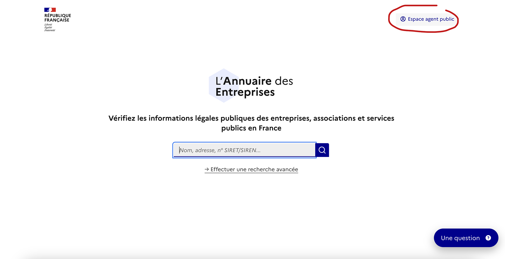

# Se connecter à l'espace agent

Vous êtes agent public ? Avec ProConnect, vous pouvez vous connecter en quelques clics a l’espace agent sur l’Annuaire des Entreprises.&#x20;



### Cliquez sur le lien de l'espace Agent Public

<figure><figcaption></figcaption></figure>




### Cliquez sur le bouton ProConnect

<figure><figcaption></figcaption></figure>




### Suivez les étapes de connexion

Utilisez votre email professionnel et laissez-vous guider



### Félicitation, vous êtes connecté(e) !&#x20;

Profitez des données de votre espace agent.


