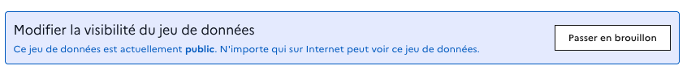

# Modifier un jeu de données

Une fois votre jeu de données publié, vous pouvez le gérer depuis l'espace d'administration.

## Voir ses jeux de données

* Connectez-vous à votre compte ;
* Cliquez sur  en haut à droite de votre écran ;
* Dans la colonne de gauche, cliquez sur&#x20;
  * le nom de votre organisation pour voir les contenus de votre organisation ;
  * Ou sur "Mon profil" pour voir les contenus publiés en votre nom ;
* Cliquez sur 

Vous pouvez consulter ici toutes les **jeux de données publiées.**

Dans la colonne **"Actions"** du tableau :&#x20;

* 👁️ Cliquez sur l’icône **œil** pour consulter le jeux de données sur l’interface publique ;
* ✏️ Cliquez sur l’icône **crayon** pour le modifier dans l’interface d’administration.


Vous pouvez aussi accéder à la modification de votre jeu de données directement depuis la page publique de celle-ci en cliquant sur le bouton .


## Modifier ses jeux de données

Le tableau de bord d’un jeu de données se compose de plusieurs onglets :



### Onglet _Métadonnées_

Cet onglet vous permet de modifier les informations relatives à ce jeu de données.

Vous pouvez également :&#x20;

### Modifier la visibilité du jeu de données

<figure><figcaption></figcaption></figure>

Un jeu de données publié au nom d’un individu ou d’une organisation peut être transféré vers un autre individu ou une autre organisation.

### Transferer un jeu de données

<figure><figcaption></figcaption></figure>

1. En bas de la page cliquez sur le bouton transférer.&#x20;
2. Saisissez le nom de l’utilisateur ou de l’organisation vers lequel vous souhaitez transférer le jeu de données, puis cliquez sur son profil quand il apparaît à l’écran ;
3. Indiquez une raison éventuelle pour ce transfert dans la zone "Commentaire" puis cliquez sur "Transférer le jeu de données" pour valider la demande de transfert ;
4. Votre destinataire reçoit alors une notification. Une fois la demande de transfert acceptée par votre destinataire, le jeu de données lui est effectivement transféré.


Attention, cette action ne peut pas être annulée.


## Supprimer un jeu de données ou une ressource

Vous pouvez supprimer un jeu de données, ou l’une des ressources qui le compose, si vous êtes l’auteur du jeu de données en question, ou si vous appartenez à l’organisation qui en est à l’origine.&#x20;


**La suppression d’un jeu de données ou d’une ressource est irréversible**



**Conservation des anciennes ressources**

Il est conseillé de supprimer le moins de ressources possibles de la plateforme data.gouv.fr. Même si vos données ne sont plus mises à jour, il est possible que des utilisateurs utilisent tout de même ces données. De plus, la suppression de certaines ressources peut entraîner la maintenance de nombreux services ou produits qui reposent sur l’exploitation des données publiées.




### Onglet _Fichiers_

Vous y retrouvez l’ensemble des **fichiers** de ce jeu de données.

Vous pouvez les réordonner, en ajouter ou en retirer.

✏️ Cliquez sur l’icône **crayon** pour modifier un fichier dans l’interface d’administration.



### Onglet _Discussions_

Cet onglet présente les **discussions** sur ce jeu de données.

* 👁️ Cliquez sur l’icône **œil** pour consulter la discussion sur l’interface publique ;
* 💬 Cliquez sur l’icône **bulle de dialogue** pour y répondre dans l’interface d’administration.



### Onglet _Activités_

Cet onglet vous donne accès à **l’historique des modifications réalisées** sur ce jeu de données.


