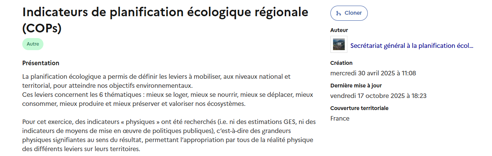

# Utiliser un bouquet

### Comprendre un bouquet

#### Le bandeau de description

<figure><figcaption></figcaption></figure>

Le bandeau de description permet d'identifier les informations clés concernant un bouquet :&#x20;

* **son titre** ;&#x20;
* **sa présentation**, telle que renseignée par le créateur du bouquet. On peut y retrouver le contexte de création du bouquet, ses enjeux, son public cible et d'éventuels liens utiles ;&#x20;
* les informations sur **l'auteur, la date de création et de dernière mise à jour** du bouquet ainsi que **sa couverture territoriale** ;
* une étiquette thématique renvoyant aux 6 thématiques définies dans le cadre du plan France Nation Verte.&#x20;

#### La composition du bouquet&#x20;

<figure><figcaption></figcaption></figure>

#### L'onglet "Données"

L'onglet **Données** permet de consulter les données et indicateurs disponibles dans le bouquet. Ces derniers peuvent être regroupés : &#x20;

* Chaque regroupement (par exemple _Agriculture, Forêts et Sols_, _Bâtiment_, _Déchets_, etc.) indique le nombre de jeux de données ou d'indicateurs disponibles et peut être **déplié** pour en consulter le détail.
* Cliquez sur la flèche à gauche du nom du regroupement pour afficher la liste des **données correspondantes**.
* Utilisez la barre “**Filtrer les données**” en haut à droite pour rechercher un jeu de données par mot-clé.

<figure><figcaption></figcaption></figure>

### Accéder aux données

En déployant un regroupement, vous accédez aux données et indicateurs qu'elle contient et vous permet de les utiliser :&#x20;

1. [Utiliser des données ](https://app.gitbook.com/o/w6D6SnLwCXQaMMSzcTvp/s/K56ETHxhBea8DHmbPCgt/~/changes/3/ecologie.data.gouv.fr/donnees/utiliser-des-donnees)
2. [Utiliser un indicateur](https://app.gitbook.com/o/w6D6SnLwCXQaMMSzcTvp/s/K56ETHxhBea8DHmbPCgt/~/changes/3/ecologie.data.gouv.fr/indicateurs/utiliser-un-indicateur)

### Cloner un bouquet&#x20;

Il est possible de cloner un bouquet en cliquant sur le bouton suivant :&#x20;

<figure><picture><source srcset="../../.gitbook/assets/Dark mode gitbook EDG(2) (7).png" media="(prefers-color-scheme: dark)"></picture><figcaption></figcaption></figure>

Cela vous permet de vous réapproprier la base d'un bouquet en ajoutant les données qui vous intéressent.&#x20;

Toute modification apportée au bouquet parent ou au bouquet enfant reste sans effet sur l'autre bouquet.&#x20;

### Des questions ?&#x20;

S'il vous reste des interrogations, plusieurs choix s'offrent à vous :&#x20;

* Pour des questions sur un bouquet, sollicitez l'aide de la communauté via **l'onglet "Discussions"** en vous connectant.&#x20;
* Pour des questions sur l'utilisation du site dont les réponses peuvent bénéficier à la communauté, publiez votre question sur [forum.data.gouv](https://forum.data.gouv.fr/).&#x20;
* Pour le reste, contactez [ecospheres@developpement-durable.gouv.fr](mailto:ecosphreres@developpement-durable.gouv.fr).

