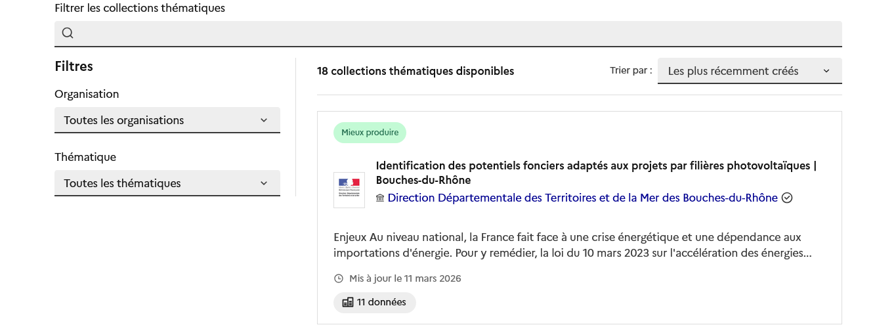

# Rechercher une collection

Pour rechercher une collection, dirigez vous vers l'onglet [Collections thématiques](./). Outre la barre de recherche permettant d'explorer les collections par mots-clés, il est aussi possible de filtrer votre recherche par :

1. **Organisation ;**
2. **Thématique.**

<figure><figcaption></figcaption></figure>

Voici un aperçu détaillé de ces filtres :



#### Organisation

Les organisations référencées sont les organisations productrices des données disponibles sur le catalogue.

Vous pouvez bénéficier d'un aperçu de celles-ci ici :





#### Thématique

Pour atteindre nos objectifs nationaux et territoriaux, le Secrétariat Général de la planification écologique a défini des leviers d'actions concernant 6 thématiques clés dans le cadre du plan **France Nation Verte** :

1. Mieux se loger ;
2. Mieux se nourrir ;
3. Mieux se déplacer ;
4. Mieux consommer ;
5. Mieux produire ;
6. Mieux préserver et valoriser nos écosystèmes.

Les collections peuvent être référencées par ces 6 thématiques France Nation Verte.

Pour en savoir plus sur le plan France Nation Verte :





Chaque collection détaille la présentation du cas d'usage et permet d'accéder aux données et indicateurs qu'elle regroupe.
