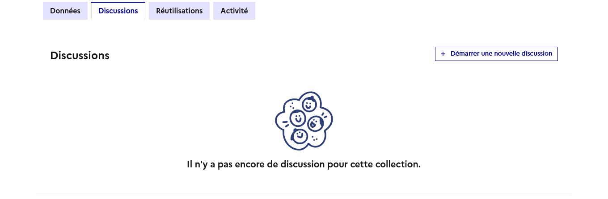
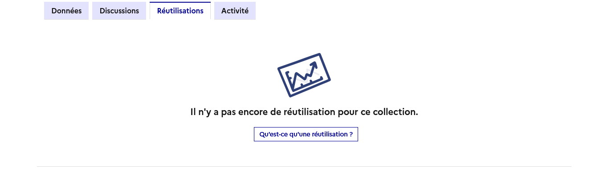
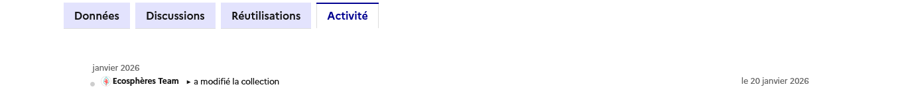

# Utiliser une collection

### Comprendre une collection :


L'interface représentée ci-dessous est celle visible par les **membres connectés** de l'organisation à laquelle est associée la collection.


#### Le bandeau de description

<figure><figcaption></figcaption></figure>

Le bandeau de description permet d'identifier les informations clés concernant une collection :&#x20;

* **son sujet** ;&#x20;
* **sa présentation**, telle que renseignée par le créateur de la collection. On peut y retrouver le contexte sa création, ses enjeux, son public cible et d'éventuels liens utiles ;&#x20;
* les informations sur **l'auteur, la date de création et de dernière mise à jour** du collection ainsi que **sa couverture territoriale** (si renseignée) ;
* une étiquette thématique renvoyant aux 6 thématiques définies dans le cadre du plan France Nation Verte.&#x20;

#### La composition de la collection&#x20;

<figure><figcaption></figcaption></figure>

#### Accéder aux données

En déployant un regroupement, vous accédez aux données et indicateurs qu'il contient et vous permet de les utiliser :&#x20;

1. [Utiliser des données ](https://guides.data.gouv.fr/ecologie.data.gouv.fr/ecologie.data.gouv.fr/toutes-les-donnees/utiliser-des-donnees)
2. [Utiliser un indicateur](https://guides.data.gouv.fr/ecologie.data.gouv.fr/ecologie.data.gouv.fr/indicateurs-phares/utiliser-un-indicateur)

### L'onglet "Données"

L'onglet **Données** permet de consulter les données et indicateurs disponibles dans la collection. Ces derniers peuvent être regroupés : &#x20;

* Chaque regroupement (par exemple _Agriculture, Forêts et Sols_, _Bâtiment_, _Déchets_, etc.) indique le nombre de jeux de données ou d'indicateurs disponibles et peut être **déplié** pour en consulter le détail.
* Cliquez sur la flèche à gauche du nom du regroupement pour afficher la liste des **données correspondantes**.
* Utilisez la barre “**Filtrer les données**” en haut à droite pour rechercher un jeu de données par mot-clé.

<figure><figcaption></figcaption></figure>

### L'onglet "Discussions"

S'il vous reste des interrogations, plusieurs choix s'offrent à vous :&#x20;

* Pour des questions sur une collection, sollicitez l'aide de la communauté via **l'onglet "Discussions"** en vous connectant.&#x20;
* Pour des questions sur l'utilisation du site dont les réponses peuvent bénéficier à la communauté, publiez votre question sur [forum.data.gouv](https://forum.data.gouv.fr/).&#x20;
* Pour le reste, contactez [ecospheres@developpement-durable.gouv.fr](mailto:ecosphreres@developpement-durable.gouv.fr).

<figure><figcaption></figcaption></figure>

### L'onglet "Réutilisations"

Les données mises à disposition sur data.gouv.fr peuvent être réutilisées [selon les termes définis dans la licence qui leur est associée](https://guides.data.gouv.fr/guides/guide-juridique/reutilisateurs-de-donnees). Si vous êtes à l’origine d’une réutilisation, vous pouvez la référencer sur la page du jeu de données sur lequel vous vous êtes appuyés.

<figure><figcaption></figcaption></figure>


En voici davantage sur [Qu'est-ce qu'une réutilisation ?](https://guides.data.gouv.fr/publier-des-donnees/guide-data.gouv.fr/reutilisations)


#### Cloner une collection&#x20;

Il est possible de cloner une collection en cliquant sur le bouton suivant :&#x20;

<figure><figcaption></figcaption></figure>

Cela vous permet de vous réapproprier la base d'une collection en ajoutant les données qui vous intéressent.&#x20;


Toute modification apportée à la collection mère ou à la collection fille reste sans effet sur l'autre.&#x20;


### L'onglet "Activité"

L’onglet **Activité** vous permet de suivre en temps réel les contributions. Il rend en cela la collaboration plus transparente. Concrètement, vous pouvez visualiser :

* qui a contribué : chaque membre de la collection apparaît clairement ;
* quand les modifications ont été effectuées ;
* quelles actions ont été réalisées : ajout, mise à jour ou suppression de jeux de données.

Cette vue vous aide à coordonner le travail collectif, à **repérer rapidement les nouveautés** et à garantir que votre collection reste à jour.

L’onglet Activité est donc un outil central pour travailler à plusieurs mains, suivre l’évolution de vos projets et maintenir la qualité de vos collections dans un cadre collaboratif et évolutif !

<figure><figcaption></figcaption></figure>


L'onglet Activité n'est visible que par les membres de l'organisation à laquelle est associée la collection. L'utilisateur doit également est connecté.

