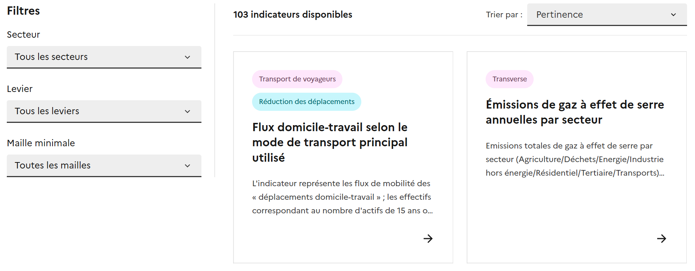

# Rechercher un indicateur

### Utiliser les filtres

Pour rechercher un indicateur, dirigez vous vers l'onglet [Indicateurs](https://ecologie.data.gouv.fr/indicators). Outre la barre de recherche générale, où vous pouvez explorer notre base par mots-clés, nous vous proposons de filtrer votre recherche par :

1. **Secteur ;**
2. **Levier ;**
3. **Maille minimale.**&#x20;

<figure><figcaption></figcaption></figure>

Voici un aperçu détaillé de ces filtres :&#x20;



### Secteur d'activité

Les indicateurs territoriaux sont référencés par secteur d'activité tels que définis dans la **Stratégie Nationale Bas Carbone** :&#x20;

* Agriculture, Forêts et Sols ;
* Alimentation ;
* Bâtiment ;
* Déchets ;
* Eau ;
* Énergie ;
* Industrie ;
* Transport de marchandises ;
* Transport de voyageurs ;
* Transverse.

Pour en savoir plus sur la Stratégie Nationale Bas Carbone :&#x20;





### Levier d'action

Pour atteindre nos objectifs nationaux et territoriaux, le Secrétariat Général à la planification écologique a définit des leviers d'actions appartenant à 6 thématiques clés dans le cadre du plan **France Nation Verte** (mieux se loger, mieux se nourrir, mieux se déplacer, mieux consommer, mieux produire, mieux préserver et valoriser nos écosystèmes).

Les indicateurs peuvent être ainsi classés par leviers d'actions (covoiturage, prévention des déchets, sobriété foncière, etc.) couvrant l'ensemble des 6 thématiques FNV.&#x20;

Pour en savoir plus sur le plan France Nation Verte :&#x20;





### Mailles disponibles

Les indicateurs sont disponibles selon différentes mailles géographiques, de la commune à la région. Il est ainsi possible de savoir grâce à ce filtre quels sont les indicateurs disponibles à une maille minimale géographique donnée, parmi les mailles suivantes :

* communale,
* intercommunale,
* départementale,
* régionale.

Ces mailles sont différentes de la _couverture géographique_ qui elle est indiquée au sein des fiches indicateurs :

* France entière, pour les indicateurs qui couvrent des régions de France métropolitaine et au moins une région des DROM
* France métropolitaine, pour les indicateurs qui ne couvrent pas de DROM



### Absence d'un indicateur

Le hub d'indicateurs disponible sur [_ecologie_.**data.gouv**._fr_](../../) constitue une base évolutive, appelée à s'enrichir et à s'affiner grâce aux retours et aux besoins exprimés par les utilisateurs.&#x20;


En cas d'absence d'un indicateur pourtant utile aux objectifs nationaux ou territoriaux, **vous pouvez nous contacter à l'adresse mail suivante** : <mark style="color:$primary;">indicateurs-transition-ecologique@developpement-durable.gouv.fr</mark>


Nos équipes sont mobilisées pour répondre à vos besoins et enrichir le hub d'indicateurs territoriaux. La richesse du catalogue repose sur la qualité des contributions (dont la publication doit être validée par un expert de référence) mais aussi sur leur nombre et leur diversité.&#x20;

En partageant vos données et vos indicateurs, vous participez à la mutualisation des connaissances et valorisez vos données et vos projets.
