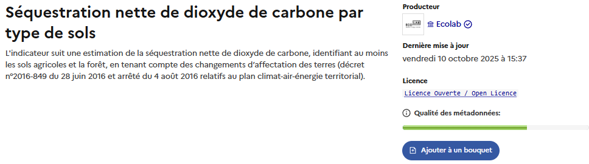
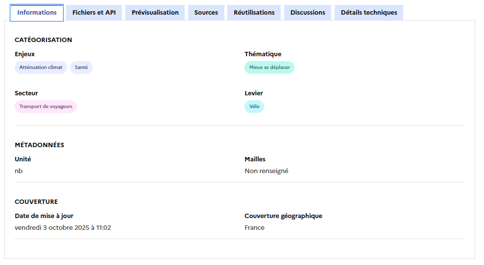
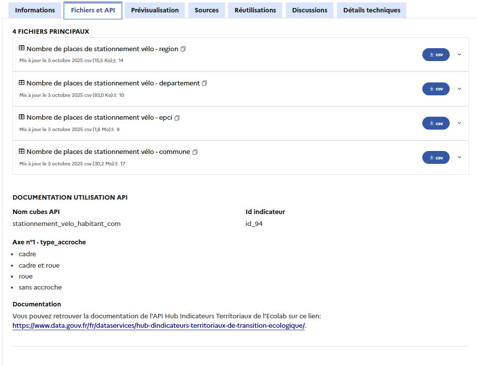
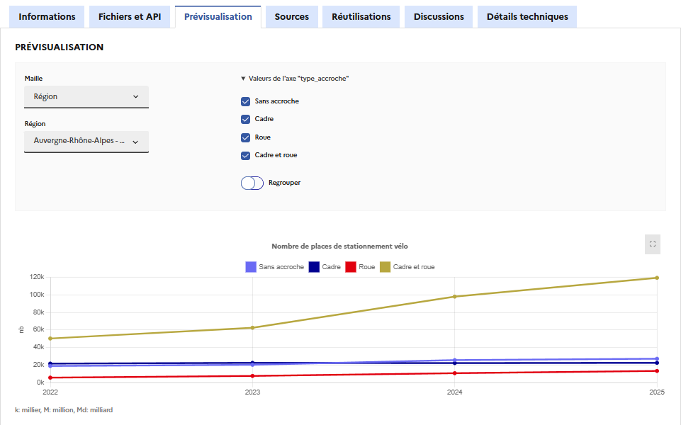
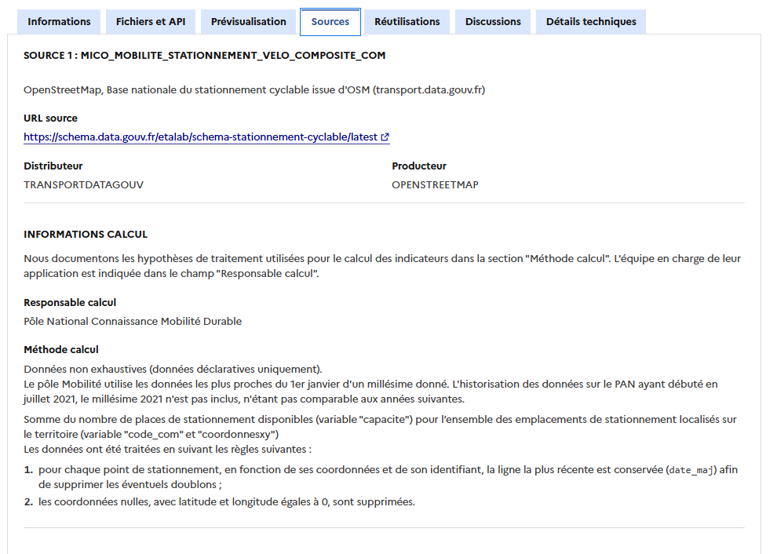
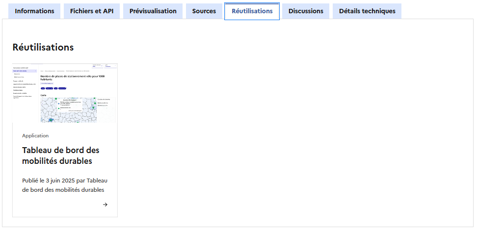
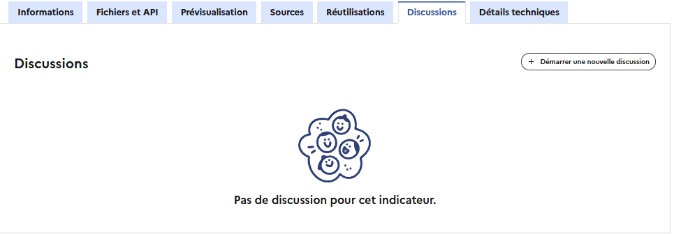

# Comprendre un indicateur

Utiliser un indicateur nécessite au préalable de comprendre les hypothèses faites pour le calculer et les limitations qui en résultent. Nous tâchons de référencer ces informations de la façon la plus précise et transparente possible sur la page de l'indicateur afin de faciliter sa compréhension.&#x20;

#### Le bandeau de description

<figure><figcaption></figcaption></figure>

Le bandeau de description permet d'identifier les informations clés concernant un indicateur :&#x20;

* son **libellé** est celui fourni par la source ou décidé par notre référent sur la thématique (DG, ministère, etc.), mis à part dans les cas où nous effectuons une modification dans son calcul ou son périmètre qui justifie un nouveau libellé ;&#x20;
* sa **description,** telle que renseignée par l'expert métier. On y retrouve des informations telles que le périmètre de l'indicateur, ses usages associés, son unité, ses axes d'analyses et les enjeux derrière son suivi ;&#x20;
* quelques [**métadonnées**](#user-content-fn-1)[^1], telles que la date de dernière mise à jour, la licence et la qualité des métadonnées.


L'amélioration des métadonnées des indicateurs est un processus constant. Aidez-nous en indiquant les défauts trouvés dans l'onglet "Discussions" de chaque indicateur.


#### L'onglet "Informations"

<figure><figcaption></figcaption></figure>

On retrouve les métadonnées descriptives décrivant un indicateur dans cet onglet, parmi lesquelles :&#x20;

* **secteur** : les secteurs correspondent aux domaines d'activité (industrie, transports, agriculture, etc.) ;
* **enjeux** : au nombre de cinq, ce sont l'adaptation, la biodiversité, l'atténuation climatique, la santé et les ressources ;
* **thématique** : ce sont les thématiques de la planification écologique (mieux se loger, mieux se nourrir, mieux consommer, mieux produire, mieux se déplacer, mieux préserver) ;
* **levier** : il s'agit de moyens d'action concrets et spécifiques de mise en œuvre de la transition écologique tels que la gestion des forêts et produits bois, l'élevage durable, ou encore la gestion des haies.

Les enjeux et thématiques sont issus d'une classification réalisée dans le cadre de [France Nation Verte](https://app.gitbook.com/u/eChkTh5760devHyjGAvetHBdcMC3), alors que les secteurs sont inspirés de la [Stratégie Nationale Bas Carbone](https://www.ecologie.gouv.fr/politiques-publiques/strategie-nationale-bas-carbone-snbc).&#x20;

On trouve également dans cet onglet des informations sur la couverture géographique de l'indicateur, son unité, les mailles auxquelles il est disponible.

#### L'onglet "Fichiers et API"

<figure><figcaption></figcaption></figure>

L'accès aux données se fait dans l'onglet "Fichiers et API", où l'indicateur peut être téléchargé selon deux modes :&#x20;

* **en fichier CSV (**_**comma separated values**_**) :** Il s'agit du format le plus utilisé pour échanger des données.&#x20;


Les outils bureautiques de type tableur (Microsoft Excel, LibreOffice Calc) permettent de lire ces fichiers et de les afficher de manière intelligibles à condition de sélectionner le séparateur "virgule" dans la fenêtre d'import du fichier. Les outils d'édition de texte permettent aussi d'ouvrir ces fichiers, notamment pour trouver la cause d'une erreur lors de l'import dans un tableur.


* **par API :** la procédure pour cela est décrite en bas de l'onglet, en suivant le lien "Documentation utilisation API".&#x20;


Un jeton, ou _token_, est nécessaire pour utiliser l'API, celui-ci peut vous être fourni en effectuant une demande par mail à l'adresse [indicateurs-transition-ecologique@developpement-durable.gouv.fr](mailto:indicateurs-transition-ecologique@developpement-durable.gouv.fr).\
Pour plus d'informations sur l'API, consultez [sa documentation ](https://www.data.gouv.fr/dataservices/hub-dindicateurs-territoriaux-de-transition-ecologique/)sur le site data.gouv.fr.


#### L'onglet "Prévisualisation"

<figure><figcaption></figcaption></figure>

Vous avez la possibilité de jouer avec les données présentes dans les fichiers d'indicateurs directement depuis l'onglet de prévisualisation.&#x20;

La prévisualisation graphique facilite la compréhension de ce qui est dans les fichiers CSV d'indicateurs publiés. Elle vous permet de sélectionner une maille donnée, un territoire donné et de visualiser les données de ce territoire uniquement.&#x20;

Les données sont affichées sous format _linegraph_, permettant ainsi de voir facilement pour un territoire

* l'évolution de l'indicateur au cours du temps ;
* la couverture temporelle de l'indicateur.

Il est possible de filtrer les données par le ou les _axes d'analyse_ disponibles dans le cas où l'indicateur en possède un.&#x20;


E.g. ci-dessus l'indicateur _Nombre de places de stationnement vélo_ possède l'axe _type d'accroche de stationnement_


#### L'onglet "Sources"

<figure><figcaption></figcaption></figure>

La source correspond au(x) jeu(x) de données utilisé(s) pour calculer l'indicateur fourni par l'Ecolab.

Un indicateur peut ainsi provenir d'**une ou plusieurs sources**. Voici des exemples de cas où un indicateur vient de plusieurs sources

* Une source est disponible à la maille EPCI et une autre à la maille départementale. Comme nous ne pouvons pas passer des EPCI à la maille supérieure avec une agrégation simple nous utilisons les deux sources afin de fournir le plus de granularité géographique possible.


e.g. Consommation d'énergie finale dont la maille EPCI vient du RARE et dont la maille régionale vient du SDES


* L'indicateur est composite et doit être rapporté au nombre d'habitant ou à la surface: nous avons ainsi la source de données de l'indicateur ainsi que la source de données de la population ou de la surface.


e.g. Tonnage total de déchets ménagers et assimiles par habitant


* L'indicateurs n'est pas calculé par le même producteur selon son axe d'analyse


L'indicateur de transport de marchandise par voie routière, ferrovière ou maritime a 3 sources de données différentes pour chaque mode de transport


L'objectif de cet onglet est de permettre à l'utilisateur de comprendre l'origine des indicateurs et les traitements appliqués sur les sources pour pouvoir créer ces indicateurs. Ainsi nous renseignons:

* les identités du producteur et du distributeur de données ;
* le lien vers le site où la source est mise à disposition ;
* une description du contenu de la source;
* la méthode de calcul utilisée pour partir des sources et arriver à l'indicateur tel qu'il est publié sur le site.

#### L'onglet "Réutilisations"

<figure><figcaption></figcaption></figure>

Si vous utilisez un indicateur dans le cadre de l'un de vos projets, il vous est possible de documenter votre réutilisation sur data.gouv et d'y associer l'indicateur pour contextualiser la façon dont cet indicateur vous est utile.


Pour plus d'informations sur les réutilisations et sur comment les publier, consultez la [documentation de data.gouv](https://guides.data.gouv.fr/guide-data.gouv.fr/reutilisations).


#### L'onglet "Discussions"

<figure><figcaption></figcaption></figure>

Il vous est possible de nous faire remonter vos questions concernant un indicateur spécifique directement depuis l'onglet Discussions en vous connectant à data.gouv.

&#x20;Les membres de nos équipes répondent aussi aux questions posées.

#### L'onglet "Détails techniques"

Cet onglet détaille la licence de réutilisation de l'indicateur, ainsi que des informations sur l'indicateur telles que son identifiant, ou les dates de création et de dernière mise à jour de l'indicateur.&#x20;

[^1]: les métadonnées sont des "_données sur les données_". Ici il s'agit d'informations standardisées permettant de décrire l'indicateur.
