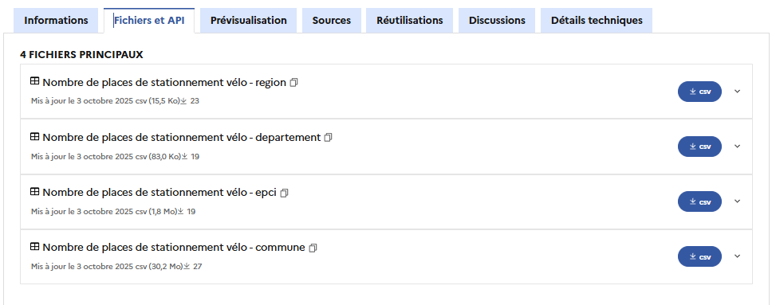

# Télécharger un indicateur

Il existe plusieurs manières de récupérer les indicateurs de transition écologique publiés sur ecologie.data.gouv.fr


L'onglet Discussions sur ecologie.data.gouv vous permet de poser des questions directement reliées à un indicateur. Nos équipes y répondront au plus vite.


## Télécharger les fichiers .csv

Vous pouvez simplement télécharger localement les fichiers de données sur votre ordinateur depuis l'onglet `Fichiers et API` &#x20;

<figure><figcaption></figcaption></figure>

## Télécharger nos indicateurs depuis notre API

L’API permet d’accéder à des indicateurs clés de la transition écologique, disponibles à différentes échelles géographiques. Celle-ci est publiée sur data.gouv sur ce lien [https://www.data.gouv.fr/dataservices/hub-dindicateurs-territoriaux-de-transition-ecologique/](https://www.data.gouv.fr/dataservices/hub-dindicateurs-territoriaux-de-transition-ecologique/)

#### URL de l'API <a href="#url" id="url"></a>

```
https://api.indicateurs.ecologie.gouv.fr
```

#### Autorisation <a href="#autorisation" id="autorisation"></a>

💡 L’API est accessible via jeton JWT. Il est à renseigner dans le _Header_ de la requête.


Le token d'accès est à demander en remplissant le [formulaire suivant.](https://grist.numerique.gouv.fr/o/ecolabservicesdonnees/forms/1d4wnsMrTwY8RaiU2WbjP8/47)

