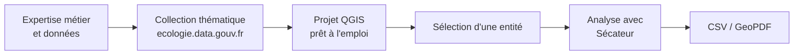

# De la donnée ouverte à l'analyse parcellaire en quelques clics

L'un des principaux intérêts de [**Sécateur**](https://github.com/ecolabdata/secateur) est de pouvoir **analyser rapidement** une entité géographique au regard d'un **grand nombre de couches**.

Mais avant de lancer la moindre intersection, une étape est souvent chronophage : **constituer le projet QGIS**. Il faut retrouver les bonnes données, organiser les couches, **vérifier qu'elles sont à jour**, etc.

Grâce aux collections thématiques d'[_ecologie._**data.gouv**._fr_](https://guides.data.gouv.fr/ecologie.data.gouv.fr), il devient possible non seulement de charger rapidement des données dans QGIS, mais aussi de **réutiliser des méthodologies déjà construites** et partagées par d'autres acteurs publics.

Les collections permettent ainsi de **mutualiser des méthodes d'analyse et des retours d'expérience**, tout en les rendant directement exploitables dans les outils SIG du quotidien.

Dans ce tutoriel, nous allons construire un projet prêt à être exploité avec **Sécateur** à partir d'une collection thématique et du parcellaire cadastral.


Sécateur est un plugin QGIS d’intersection spatiale automatique pour l’analyse territoriale et la production de GeoPDF multicouches, initialement développé par la DDT21, puis généralisé par notre équipe dans l'optique de le généraliser et de le mutualiser à d'autres services.

Vous pouvez y accéder via ce lien : [https://github.com/ecolabdata/secateur](https://github.com/ecolabdata/secateur)


### Le besoin

Imaginons que nous souhaitions analyser le potentiel photovoltaïque d'un terrain.

Pour cela, nous devons généralement consulter de nombreuses données : zonages réglementaires, enjeux environnementaux, servitudes, occupation des sols, contraintes territoriales, etc.

La difficulté n'est pas tant l'analyse que la constitution du projet de travail.

## Utilisation

### 1. Charger une collection thématique dans QGIS

***

[_ecologie._**data.gouv**._fr_](https://guides.data.gouv.fr/ecologie.data.gouv.fr) propose des **collections thématiques** regroupant des jeux de données utiles à une problématique métier. Pour cet exemple, nous utiliserons la collection :

<figure><figcaption>
<strong>Identification des potentiels fonciers adaptés aux projets par filières photovoltaïques - Bouches-du-Rhône</strong>
</figcaption></figure>

> Cette collection illustre parfaitement l'intérêt des collections thématiques : au-delà d'un simple regroupement de données, elle formalise une méthode d'analyse développée par la DDTM13 et la rend réutilisable par d'autres territoires.
>
> Plutôt que de reconstruire un projet à partir de zéro, chacun peut s'appuyer sur cette expérience, charger les données associées dans QGIS et adapter la démarche à son propre contexte.

La collection est disponible ici :



En bas de la page, cliquez sur :

<figure><figcaption></figcaption></figure>

Toutes les couches de la collection disposant de services WFS/WMS sont automatiquement ajoutées au projet. Un fichier QLR est alors généré et ouvert dans QGIS :

<figure><figcaption>
Ouverture dans QGIS d'une collection thématique directement depuis <em>ecologie.</em><strong>data.gouv</strong><em>.fr</em>
</figcaption></figure>

Ainsi, en quelques secondes, le projet contient déjà les principales couches utiles à l'étude. Sans cette fonctionnalité, chacune de ces couches devrait être recherchée et ajoutée individuellement.


Vous pouvez retrouver le tutoriel pour ouvrir une collection thématique dans QGIS sur cette page : [ouvrir-une-collection-dans-qgis.md](../collections-thematiques/ouvrir-une-collection-dans-qgis.md "mention")


### 2. Ajouter le parcellaire cadastral

***

Pour utiliser Sécateur, il nous faut maintenant une entité géométrique de référence pour l'intersection.

<figure><figcaption></figcaption></figure>

Utilisons le **Plan Cadastral Informatisé (PCI)**, lui aussi disponible sur [_ecologie._**data.gouv**._fr_](https://guides.data.gouv.fr/ecologie.data.gouv.fr) :




Nous pouvons à nouveau ajouter la couche cadastrale au projet QGIS grâce à [ouvrir-un-jeu-de-donnees-dans-qgis.md](../toutes-les-donnees/ouvrir-un-jeu-de-donnees-dans-qgis.md "mention").


À ce stade, nous disposons d'un ensemble de couches métier et d'une entité géographique à étudier : **nous pouvons utiliser Sécateur !**

### 3. Lancer l'analyse avec Sécateur

***

Ouvrez le panneau de Sécateur puis :

1. Sélectionner une parcelle ;
2. Cliquer sur "Réaliser l’intersection" ;
3. Sécateur analyse automatiquement l'ensemble des **couches visibles** du projet, et produit les rapports cartographiques et csv.

<figure><figcaption>
Utilisation de Sécateur.
</figcaption></figure>

Accéder à la documentation de Sécateur :



## Conclusion

Les collections thématiques d'[_ecologie._**data.gouv**._fr_](https://guides.data.gouv.fr/ecologie.data.gouv.fr) permettent de **partager bien plus que des données** : elles diffusent également des **méthodologies et des retours d'expérience** **réutilisables** par toutes et tous.

Associées à Sécateur, elles offrent une **base de travail immédiatement exploitable** pour réaliser des analyses territoriales sans avoir à reconstruire un projet SIG complet.

Cette complémentarité permet de **passer rapidement de la donnée ouverte à l'analyse territoriale**, en consacrant moins de temps à la préparation des données et davantage à l'interprétation des résultats.
