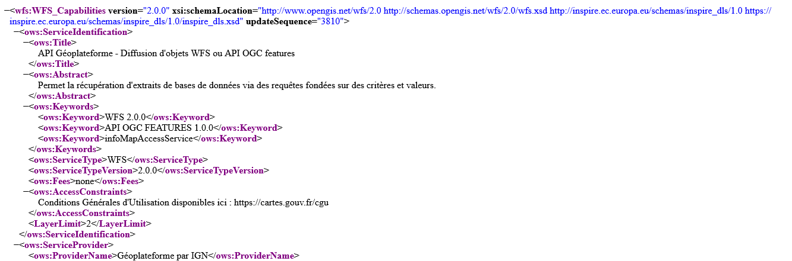
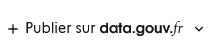
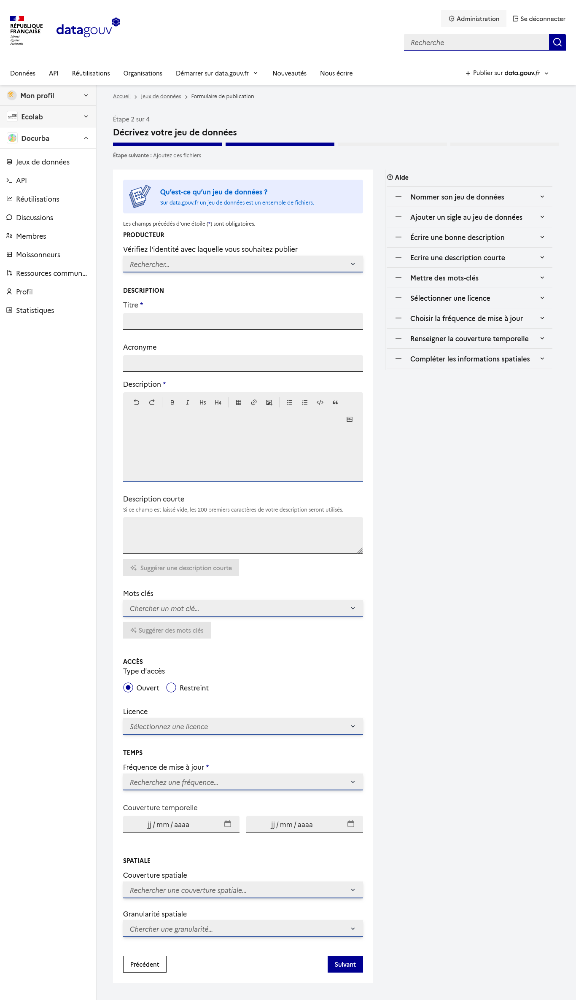
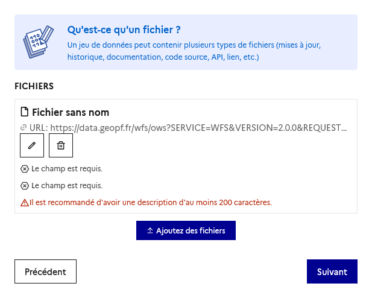

# Référencer un service WFS/WMS dans un jeu de données

Lorsqu'on travaille avec des données géographiques, les services OGC tels que les services WFS constituent un mode de diffusion courant. Ils permettent d'accéder à plusieurs couches de données via un même endpoint, mais leur structure est principalement pensée pour des clients SIG ou des applications techniques.

Néanmoins, côté métier, l'objectif n'est cependant pas de référencer le service dans son ensemble, mais de rendre visible une **couche métier précise**, facilement identifiable et réutilisable.

Ce tutoriel montre comment référencer un service WFS dans un jeu de données sur [**data.gouv**._fr_](https://data.gouv.fr), en utilisant le **GetCapabilities** pour identifier la couche à publier.

### Le besoin

Prenons l'exemple des **Arrêtés préfectoraux de Protection de Biotope (APB)** diffusés par la [Géoplateforme de l'IGN](https://www.ign.fr/geoplateforme).

Les données sont accessibles via le service WFS suivant :

```
https://data.geopf.fr/wfs/ows?SERVICE=WFS&VERSION=2.0.0&REQUEST=GetCapabilities
```

Ce service contient plusieurs couches. Il constitue un point d'accès technique, mais ne permet pas d'identifier directement une donnée métier particulière.

L'objectif est donc :

* d'identifier la couche correspondant aux APB ;
* de créer un jeu de données dédié sur [**data.gouv**._fr_](https://data.gouv.fr) ;
* d'y associer le service WFS de la couche comme ressource.

On pourra retrouver le résultat final ici :&#x20;





### Identifier la couche dans le GetCapabilities

Le document **GetCapabilities** décrit le contenu d'un service WFS. Il liste notamment l'ensemble des couches disponibles ainsi que leurs principales métadonnées. Accessible via [l'URL précédente](https://data.geopf.fr/wfs/ows?SERVICE=WFS\&VERSION=2.0.0\&REQUEST=GetCapabilities), en voici des extraits :

<figure><figcaption><p>En-tête du service.</p></figcaption></figure>

<figure><figcaption><p>Extrait de la couche recherchée.</p></figcaption></figure>

Dans notre exemple, la couche recherchée est identifiée par la balise suivante :

```xml
<Name>patrinat_apb:apb</Name>
```

Cette valeur correspond au nom de la couche (_typeName_) utilisé par le service WFS.

Elle est composée de :

* le namespace : `patrinat_apb`
* le nom de la couche : `apb`

Cette information permettra d'**identifier précisément la donnée** au moment de la publication.



### Créer le jeu de données dans [**data.gouv**._fr_](https://data.gouv.fr)

Depuis [**data.gouv**._fr_](https://data.gouv.fr), sélectionnez et un jeu de données :

<figure><figcaption></figcaption></figure>

Une fois sur l'interface d'administration de **data.gouv**_.fr_ :



Sélectionnez **commencer la publication** :

<figure><figcaption></figcaption></figure>

Remplissez les informations générales (titre, description, producteur, fréquence de mise à jour, etc.) relatives au jeu de données.

<figure><figcaption></figcaption></figure>

Pour notre exemple, nous remplissons les champs obligatoires comme ceci :

| Titre                    | Arrêté préfectoral de Protection de Biotope (APB)                                                                                                                                                                                                    |
| ------------------------ | ---------------------------------------------------------------------------------------------------------------------------------------------------------------------------------------------------------------------------------------------------- |
| Description              | <p>Accès aux données de l'INPN diffusées via les services de la Géoplateforme de l'IGN.<br></p><p>Source : <a href="https://geoservices.ign.fr/services-geoplateforme-diffusion">https://geoservices.ign.fr/services-geoplateforme-diffusion</a></p> |
| Type d'accès             | Ouvert                                                                                                                                                                                                                                               |
| Fréquence de mise à jour | Non planifié                                                                                                                                                                                                                                         |
| Granularité spatiale     | Autre                                                                                                                                                                                                                                                |

À ce stade, le jeu de données est créé mais ne contient encore aucune ressource.



### Ajouter la ressource WFS

Depuis le jeu de données, choisir : **Ajouter des fichiers**

<figure><figcaption></figcaption></figure>

Puis renseigner l'URL du document GetCapabilities :

```
https://data.geopf.fr/wfs/ows?SERVICE=WFS&VERSION=2.0.0&REQUEST=GetCapabilities
```

La ressource pointe ainsi vers le point d'entrée du service WFS.

<figure><figcaption></figcaption></figure>

En cliquant sur modifier le fichier, on va pouvoir lui ajouter un nom.



### Nommer la ressource

<figure><figcaption></figcaption></figure>

Le nom de la ressource doit permettre d'identifier la couche concernée dans le service.

Il faut donc impérativement reprendre exactement la valeur du champ `<Name>` trouvée dans le GetCapabilities :

```
patrinat_apb:apb
```

Cette convention présente plusieurs avantages :

* elle identifie sans ambiguïté la couche publiée ;
* elle facilite la correspondance avec le service WFS d'origine ;
* elle permet aux utilisateurs de retrouver rapidement le nom de couche à utiliser dans un client SIG comme QGIS ou lors d'appels WFS.

Vous pouvez ajouter autant de fichiers que de couches souhaitées via cette méthode. A noter également, que dans le cas des services WMS, cette convention débloque des services de prévisualisation.

<figure><figcaption><p><a href="https://ecologie.data.gouv.fr/datasets/6924777b1c6bca1a367ad694">https://ecologie.data.gouv.fr/datasets/6924777b1c6bca1a367ad694</a></p></figcaption></figure>



### À retenir

Le **GetCapabilities** constitue l'inventaire des couches d'un service WFS.

Pour publier une couche sur data.gouv.fr :

* identifier la couche recherchée à partir de sa balise `<Name>` ;
* créer un jeu de données décrivant le contenu métier ;
* ajouter l'URL du GetCapabilities comme ressource ;
* nommer cette ressource avec le **nom exact de la couche** (`typeName`).

Cette approche permet de référencer une couche métier tout en conservant un lien explicite avec le service WFS dont elle est issue, et ainsi pouvoir l'utiliser facilement dans des collections thématiques par exemple.

### Conclusion

La publication d'un jeu de données à partir d'un service WFS améliore la découvrabilité et la réutilisation des données diffusées par les services OGC.

En s'appuyant sur le document GetCapabilities et sur le nom de la couche (`typeName`), il devient possible de documenter précisément une donnée métier tout en conservant un accès au service d'origine.

Cette méthode facilite l'utilisation des données dans des logiciels SIG tels que QGIS ou dans des traitements automatisés.

