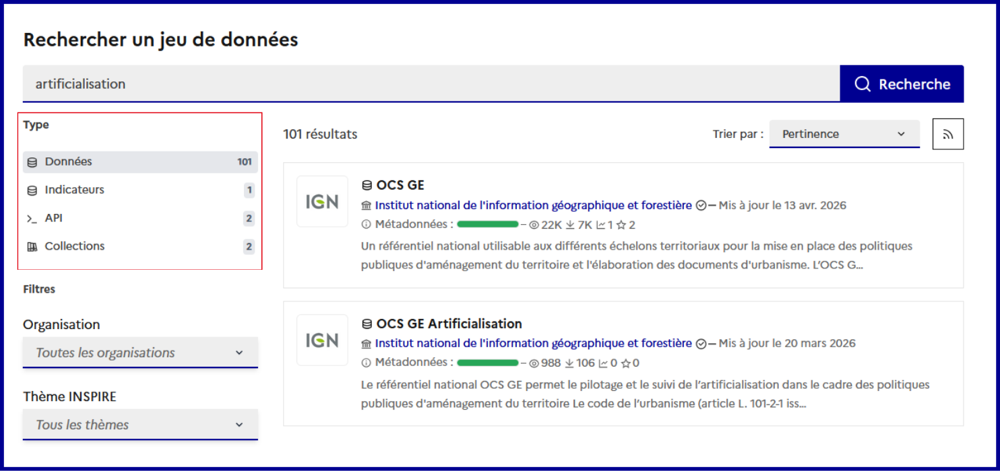

# Actualités

#### **\[11 juin 2026] - Recherche unifiée**

<figure><figcaption></figcaption></figure>

Les tests utilisateurs ont montré qu'il était difficile de naviguer entre les jeux de données, indicateurs, API et collections sur [_ecologie_.**data.gouv**._fr_](https://ecologie.data.gouv.fr/). Les onglets actuels obligent à des allers-retours fréquents et compliquent la recherche d'information.

Pour y remédier, une **recherche unifiée est désormais disponible**. Elle permet de **chercher simultanément dans tous les types de contenus**, tout en conservant les filtres spécifiques : labels pour les jeux de données, secteurs et mailles géographiques pour les indicateurs, thématiques pour les collections.

Ce nouveau mode simplifie l'accès aux ressources publiées. D'autres évolutions sont à l'étude, comme la recherche sémantique ou la recherche par territoire.

#### **\[8 juin 2026] - Nouveaux indicateurs sur la forêts**

Six nouveaux indicateurs produits par l'IGN sont désormais disponibles sur le hub afin de suivre l'état, la conservation et la gestion des forêts. Ils portent sur la surface forestière (par essence ou type de propriété), le taux de boisement, les superficies de forêts plantées ainsi que les volumes et flux de bois.

Cette première série d'indicateurs viendra prochainement s'enrichir de nouvelles données pour compléter les connaissances utiles à la gestion durable et à la protection des forêts.

#### **\[25 mai 2026] - Vers la mutualisation de plugin QGIS pour l'analyse territoriale**

Les collections thématiques d'[_ecologie_.**data.gouv**._fr_](https://ecologie.data.gouv.fr/) sont un support de partage, non seulement des données et des méthodes d'analyse **réutilisables par tous les territoires**, mais elles s'interfacent aussi avec des **outils utilisés par la communauté** tel que QGIS avec la fonctionnalité « [Ouvrir dans QGIS (WFS/WMS)](https://guides.data.gouv.fr/ecologie.data.gouv.fr/ecologie.data.gouv.fr/collections-thematiques/ouvrir-une-collection-dans-qgis) ». En les ouvrant directement dans QGIS, les utilisateurs disposent d'un **projet prêt à l'emploi** sans avoir à rechercher et assembler manuellement de nombreux jeux de données, tout en utilisant les **plugin développés par la communauté**.

C'est dans cette logique que s'inscrit notre action autour de [**Sécateur**](https://github.com/ecolabdata/secateur), un plugin QGIS **initialement développé par la direction départementale de la Côte-d'Or** (DDT 21) puis **généralisé pour faciliter son usage par d'autres services**. Après sélection d'une parcelle, Sécateur interroge les différentes données géographiques et génère des exports PDF et CSV des éléments intersectés sur la parcelle. Il répond à des **besoins plus large** d'analystes travaillant dans le domaine de l’urbanisme

Actuellement en phase de test, Sécateur illustre comment [_ecologie_.**data.gouv**._fr_](https://ecologie.data.gouv.fr/) peut accélérer le **passage de la donnée ouverte à l'analyse territoriale** en mutualisant à la fois les données, les méthodes et les outils.


Accéder à la page [les-tutoriels](../ecologie.data.gouv.fr/les-tutoriels/ "mention") pour découvrir un exemple concret.


#### \[17 avril 2026] - **Nouveaux indicateurs sur les achats durables**

Huit nouveaux indicateurs sur la thématique des **achats durables** ont également été ajoutés au hub. Retrouvez-y la [**part des marchés publics intégrant au moins une considération environnementale**](https://ecologie.data.gouv.fr/indicators/69e0e6bea78a15ba218ca355) **ou** [**sociale**](https://ecologie.data.gouv.fr/indicators/69e0e656f5f846ed8b83ef30) (en nombre et en montant), la [**part des marchés publics attribués à des ESUS**](https://ecologie.data.gouv.fr/indicators/69e0a0f299a0df54d02dc833) et ceux [**attribués à des fournisseurs inclusifs**](https://ecologie.data.gouv.fr/indicators/69e0e66003eb7ba61b2a903c), pour les marchés passés par les collectivités. Ces indicateurs doivent être contenus dans les **Schéma de Promotion des Achats publics Socialement et Ecologiquement Responsables (SPASER)** des acheteurs soumis à la réalisation d’un SPASER par le code de la commande publique. Une commande publique plus durable permet d’atténuer la pression sur les ressources naturelles nécessaires à leur production et constitue un levier de mobilisation de la sphère privée, y compris sur les enjeux sociaux.

#### \[9 avril 2026] - **Nouvel indicateur sur les émissions de polluants**

Un indicateur sur les « [**émissions annuelles de polluants**](https://ecologie.data.gouv.fr/indicators/69c293857d7c7a4df9fa4f02) » (SO2, NOx, COVNM, PM2.5, PM10, NH3) a été publié au sein du hub. Chaque **Association agréée de surveillance de la qualité de l’air (AASQA)** produit un inventaire régional des émissions, par polluant et par EPCI. Ces inventaires sont regroupés sur la plateforme d’[Atmo France](https://www.atmo-france.org/article/atmo-data-un-acces-unique-aux-donnees-produites-par-les-aasqa) dont sont extraites les données utilisées pour la construction de cet indicateur.

#### \[7 avril 2026] - **Modification de l'indicateur sur les prélèvements d'eau par usage**

Modification de la méthode de calcul pour l’indicateur [**prélèvements d’eau par usage**](https://ecologie.data.gouv.fr/indicators/67cad6eb1b824c076b3a4b79) qui **ne prend plus en compte les volumes pour l’hydroélectricité**. Le SDES a fait le choix de le retirer du calcul de l’indicateur qu’ils partagent dans les Indicateurs territoriaux de développement durable (ITDDs) pour la raison suivante : « Les volumes d’eau interceptés par les barrages hydro-électriques sont de loin les plus importants, ils représentent des centaines de milliards de mètres cubes, toutefois les barrages n’entraînent pas de prélèvements directs dans les ressources en eau. Ils ne sont pas retenus du fait qu’ils ne constituent pas un réel prélèvement. » L’indicateur du hub a été mis à jour avec cette nouvelle définition.

#### \[2 avril 2026] - **Vers une gestion plus fine de l’univers** [_ecologie_.**data.gouv**._fr_](http://ecologie.data.gouv.fr)

L’univers [_ecologie_.**data.gouv**._fr_](http://ecologie.data.gouv.fr) correspond à un sous-ensemble spécifique de jeux de données, API et collections thématiques référencés par [**data.gouv**._fr_](https://www.data.gouv.fr/) _._

Désormais, la gestion de l’univers d’[_ecologie_.**data.gouv**._fr_](http://ecologie.data.gouv.fr)[ ](https://ecologie.data.gouv.fr/)permet une sélection **jeu de données par jeu de données**. Concrètement, la gestion technique s’appuie sur un document **Grist** où sont listés les éléments (organisations, jeux de données, API, etc.) à inclure ou exclure pour chaque univers, parmi tous les éléments publiés sur [**data.gouv**._fr_](https://www.data.gouv.fr/) . Cette approche permet d’intégrer des données provenant d’organisations dont le champ d’action dépasse les seules thématiques environnementales telles que les collectivités territoriales qui produisent des donnés clés sur l’occupation des sols.

Cette évolution ouvre la voie à la gestion par des communautés d’organisations appartenant à un même domaine. Ce chantier fait l’objet de travaux en cours avec les systèmes d’information fédérateurs de la biodiversité, de l’eau et des milieux marins ainsi que le GD4H. Un atelier le 8 avril a permis d’échanger sur les besoins et les opportunités offertes par cette nouvelle organisation.

#### \[10 mars 2026] - **Une nouvelle collection thématique sur les potentiels de déploiement du photovoltaïque**

Une **collection** constitue un **ensemble de jeux de données ou d’indicateurs** organisés par cas d’usage, c’est-à-dire par politique publique ou par projet.

**L’objectif ?** Mettre en valeur des **initiatives concrètes et reproductibles**, pour favoriser le partage d’expériences entre territoires et renforcer la cohérence et l’efficacité des actions publiques grâce à une **utilisation optimale des données**.

**Découvrez la collection de la DDTM 13**

<figure><figcaption></figcaption></figure>

Vous pouvez dès à présent la tester dans QGIS avec la fonctionnalité « [Ouvrir dans QGIS (WFS/WMS)](https://guides.data.gouv.fr/ecologie.data.gouv.fr/ecologie.data.gouv.fr/collections-thematiques/ouvrir-une-collection-dans-qgis) », puis créer une collection **dans votre territoire** grâce à sa méthodologie !

Dans le cadre des enjeux d’autonomie énergétique s’appuyant sur les énergies renouvelables, cette collection propose une [**méthodologie complète**](https://www.paca.developpement-durable.gouv.fr/IMG/pdf/20230509_aide_identification_potentiels_pv_ddtm13.pdf) pour identifier les zones foncières adaptées au développement du photovoltaïque, en tenant compte des enjeux réglementaires et territoriaux.

**Un grand merci à la DDTM13** pour avoir élaboré cette méthodologie complète, conçu cette collection, et nous avoir permis de la mettre en valeur afin de favoriser le partage d’expériences.

[**Lien vers la collection**](https://ecologie.data.gouv.fr/bouquets/identification-des-potentiels-fonciers-adaptes-aux-projets-par-filieres-photovoltaiques-bouches-du-rhone-1)

#### \[5 mars 2026] - **Ouverture dans QGIS de services WFS/WMS à partir d’une collection**

Lorsqu'un jeu de données est rattaché à une **collection** et qu'il contient des **services WFS et/ou WMS**, il est désormais possible de l'**ouvrir directement dans QGIS** en cliquant sur le **bouton** « **Ouvrir dans QGIS** » sur la carte du jeu de données, comme décrit dans l’image ci-dessus.

Dans le contexte de collections volumineuses telles que celles sur les documents d’urbanisme porté par [Docurba](https://ecologie.data.gouv.fr/bouquets/elaboration-ou-evolution-dun-document-durbanisme), cette fonctionnalité permet d’**exporter** en un clic l’ensemble des jeux de données contenant des services WFS et/ou WMS dans un outil de prédilection pour leur analyse.

L’équipe [_ecologie_.**data.gouv**._fr_](http://ecologie.data.gouv.fr) est à l’écoute de tout retour sur cette nouvelle fonctionnalité disponible en version beta.

\[[En savoir sur cette fonctionnalité](https://guides.data.gouv.fr/guides-de-data.gouv.fr/ecologie.data.gouv.fr/ecologie.data.gouv.fr/bouquets/ouvrir-dans-qgis)]

<figure><figcaption><p>Exemple d'utilisation de la nouvelle fonctionnalité d'ouverture dans QGIS</p></figcaption></figure>

#### \[2 mars 2026] - **Enrichissement des points de contact des indicateurs :**

Afin de rendre visible les différents points de contact pour un indicateur nous avons publié des informations de contact dans les pages indicateurs, comme dans l’exemple ci-dessus. Trois rôles sont possibles:

* **Editeur** : L’entité qui publie le jeu de donnée sur [**data.gouv**.fr](http://data.gouv.fr) : l’Ecolab
* **Producteur** : L’entité responsable du calcul de l’indicateur, si le champ n’est pas renseigné, l’entité responsable est l’Ecolab
* **Fournisseur** : L’entité productrice des données sources
* **Contact** : Le mail de la personne à contacter en cas de question sur les indicateurs, si le champ n’est pas renseigné, il est conseillé d’utiliser l’onglet de discussion.
*

```
<figure><figcaption></figcaption></figure>
```

#### \[26 février 2026] - **Publication de données sur la mer et le littoral**

* Les jeux de données du portail [**GéoLittoral**](https://www.geolittoral.developpement-durable.gouv.fr/) sont désormais accessibles sur [_ecologie_.**data.gouv**._fr_](http://ecologie.data.gouv.fr) sous l’organisation du [Cerema](https://www.cerema.fr/fr). La publication de ces données, essentielles à la gestion et à la **protection de la mer et du littoral**, est le fruit d’une collaboration entre l’**Ecolab**, le **Cerema** et la **Direction générale des affaires maritimes, de la pêche et de l’Aquaculture du ministère de la Transition écologique (DGAMPA)**.

\[[Accéder aux jeux de données GéoLittoral](https://ecologie.data.gouv.fr/datasets/691e0df50379dac5d0a376d1)]

* Un accompagnement analogue de la [**DREAL Bretagne**](https://www.bretagne.developpement-durable.gouv.fr/) a permis la republication de leurs données sur[_ecologie_.**data.gouv**._fr_](http://ecologie.data.gouv.fr) permettant le pilotage et la **mise en œuvre régionale des politiques de développement durable** notamment, en matière d’environnement, de prévention des risques naturels et technologiques, de développement et d’aménagement durables, de transport et de logement.

\[[Accéder aux jeux de données de la DREAL Bretagne](https://ecologie.data.gouv.fr/datasets?organization=67a34f4cfe9d312c39d50e50#list)]

#### \[Janvier 2026] - **Enrichissement et modification des indicateurs de type ratio**

* En complément de la colonne « **valeur** » qui représente l’indicateur, les colonnes « **numérateur** » et « **dénominateur** » qui ont servi à calculer l’indicateur ont été ajoutées dans les fichiers CSV d’indicateurs ;
* La colonne **valeur** de l’ensemble des indicateurs de ratio et de taux a été mise à jour et multipliée par 100 afin que les valeurs des indicateurs de pourcentage soit comprises **entre 0 et 100**, et non plus en 0 et 1. Cette décision a été prise afin de s’aligner avec les standards utilisés dans les publications de l’INSEE ;

\[[Nombre de places de stationnement vélo pour 1000 hab.](https://ecologie.data.gouv.fr/indicators/67f989c8d9b3a8440f204aa7)]
