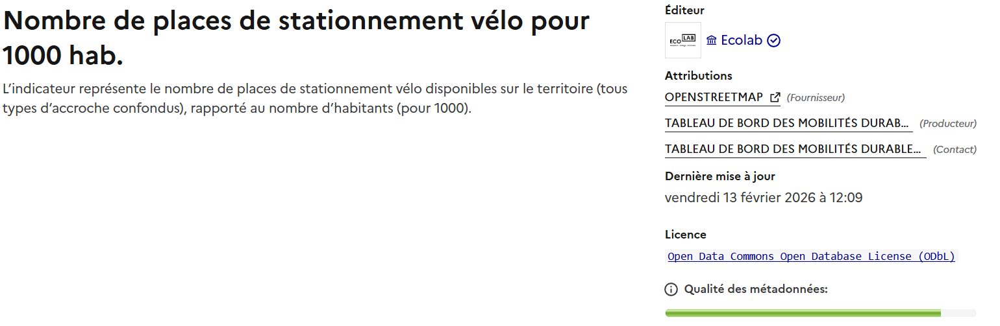

# Actualités

### **Nouvelles fonctionnalités :**

<figure><figcaption>
Exemple d'utilisation de la nouvelle fonctionnalité d'ouverture dans QGIS
</figcaption></figure>

#### **Ouverture dans QGIS de services WFS/WMS à partir d’un bouquet :**

* Lorsqu'un jeu de données est rattaché à un bouquet et qu'il contient des services WFS et/ou WMS, il est désormais possible de l'ouvrir directement dans QGIS en cliquant sur le bouton "Ouvrir dans QGIS" sur la carte du jeu de données, comme décrit dans l’image ci-dessus.
* Dans le contexte de bouquets de données volumineux tels que celui sur les documents d’urbanisme porté par [Docurba](https://ecologie.data.gouv.fr/bouquets/elaboration-ou-evolution-dun-document-durbanisme) cette fonctionnalité permet d’exporter en un clic l’ensemble des jeux de données contenant des services WFS et/ou WMS dans un outil de prédilection pour leur analyse.
* L’équipe [_ecologie_.**data.gouv**._fr_](http://ecologie.data.gouv.fr) est à l’écoute de tout retour sur cette nouvelle fonctionnalité disponible en version beta.

\[[En savoir sur cette fonctionnalité](https://guides.data.gouv.fr/guides-de-data.gouv.fr/ecologie.data.gouv.fr/ecologie.data.gouv.fr/bouquets/ouvrir-dans-qgis)]

<figure><figcaption></figcaption></figure>

#### **Enrichissement des points de contact des indicateurs :**

Afin de rendre visible les différents points de contact pour un indicateur nous avons publié des informations de contact dans les pages indicateurs, comme dans l’exemple ci-dessus. Trois rôles sont possibles:

* **Editeur** : L’entité qui publie le jeu de donnée sur [**data.gouv**.fr](http://data.gouv.fr) : l’Ecolab
* **Producteur** : L’entité responsable du calcul de l’indicateur, si le champ n’est pas renseigné, l’entité responsable est l’Ecolab
* **Fournisseur** : L’entité productrice des données sources
* **Contact** : Le mail de la personne à contacter en cas de question sur les indicateurs, si le champ n’est pas renseigné, il est conseillé d’utiliser l’onglet de discussion.

#### **Enrichissement et modification des indicateurs de type ratio :**

* En complément de la colonne “**valeur”** qui représente l’indicateur, les colonnes “**numérateur”** et “**dénominateur”** qui ont servi à calculer l’indicateur ont été ajoutées dans les fichiers CSV d’indicateurs ;
* La colonne **valeur** de l’ensemble des indicateurs de ratio et de taux a été mise à jour et multipliée par 100 afin que les valeurs des indicateurs de pourcentage soit comprises **entre 0 et 100**, et non plus en 0 et 1. Cette décision a été prise afin de s’aligner avec les standards utilisés dans les publications de l’INSEE ;

\[[Nombre de places de stationnement vélo pour 1000 hab.](https://ecologie.data.gouv.fr/indicators/67f989c8d9b3a8440f204aa7)]

### **Nouvelles données pour le suivi de la transition écologique :**

* Les jeux de données du portail [**GéoLittoral**](https://www.geolittoral.developpement-durable.gouv.fr/) sont désormais accessibles sur [_ecologie_.**data.gouv**._fr_](http://ecologie.data.gouv.fr) sous l’organisation du [Cerema](https://www.cerema.fr/fr). La publication de ces données, essentielles à la gestion et à la protection de la mer et du littoral, est le fruit d’une collaboration entre l’Ecolab, le Cerema et la Direction générale des affaires maritimes, de la pêche et de l’Aquaculture du ministère de la Transition écologique (DGAMPA).

\[[Accéder aux jeux de données GéoLittoral](https://ecologie.data.gouv.fr/datasets/691e0df50379dac5d0a376d1)]

* Un accompagnement analogue de la [**DREAL Bretagne**](https://www.bretagne.developpement-durable.gouv.fr/) a permis la republication de leurs données sur[_ecologie_.**data.gouv**._fr_](http://ecologie.data.gouv.fr) permettant le pilotage et la mise en œuvre régionale des politiques de développement durable notamment, en matière d’environnement, de prévention des risques naturels et technologiques, de développement et d’aménagement durables, de transport et de logement.

\[[Accéder aux jeux de données de la DREAL Bretagne](https://ecologie.data.gouv.fr/datasets?organization=67a34f4cfe9d312c39d50e50#list)]

