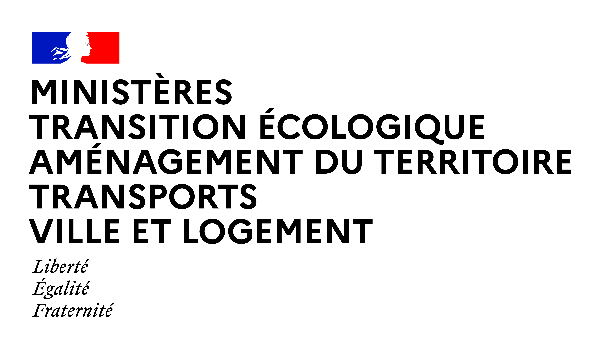

# Ecolab

<figure><figcaption></figcaption></figure>

**LʼEcolab** est le laboratoire dʼinnovation du Commissariat général au développement durable (CGDD) au service de la transition écologique. Sa position au CGDD, direction transversale du Ministère de la transition écologique, le place au centre de l'écosystème des acteurs impliqués dans ces thématiques. Son rôle d'administrateur ministériel des données, des algorithmes et des codes sources (AMDAC) lui donne les outils clés pour offrir un meilleur accès à la donnée pour les territoires, les entreprises et les citoyens. En hébergeant le Conseil National de lʼInformation Géolocalisée (CNIG), il fédère les acteurs du domaine et travaille à améliorer la qualité des données géolocalisées.

Plus d'informations sur [le site d'Ecolab](https://greentechinnovation.fr/).

L'équipe derrière [_ecologie._**data.gouv**_.fr_](https://ecologie.data.gouv.fr) est constituée de profils techniques ayant une expérience de l'administration. Nous sommes appuyés par nos collègues au sein de l'Ecolab pour la communication, le déploiement, les relations avec certains partenaires... Nos compétences sont centrées sur le développement de l'outil : nous nous reposons sur nos référents et sur les utilisateurs pour déployer les données, indicateurs et bouquets pertinents pour la transition écologique. C'est à dire vous !

<figure><figcaption></figcaption></figure>

