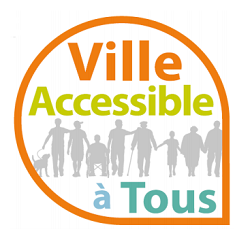

# Déploiement du standard

**Le déploiement n’est pas nécessairement du ressort du groupe de travail d’élaboration du standard au CNIG, mais ce dernier tient parfois un rôle dans son adoption.**&#x20;

***

## <mark style="background-color:purple;">Actions de la phase</mark>



### <mark style="color:purple;">ACCOMPAGNER LE DÉPLOIEMENT</mark>

L’accompagnement au déploiement est important mais n’est pas du ressort du groupe de travail d’élaboration du standard. Néanmoins, les membres du GT ayant généralement tout intérêt à poursuivre les efforts lors du déploiement, voici quelques pistes de réponses aux questions que vous pourriez vous poser :&#x20;

* **Pourquoi ?**

Le déploiement du standard est essentiel à son appropriation par l’ensemble des producteurs de données. Tous n’ayant pas participé au GT, l’accompagnement à sa compréhension et à sa prise en main sont nécessaires à son utilisation. Il s’agit aussi de mobiliser plus largement sur les enjeux portés par une politique publique lors de cette phase.

A cette étape, les services de communication des entités portant le standard peuvent être contactés pour établir une stratégie de diffusion.

* **Quand ?**

Le déploiement peut être initié avant la validation du standard, pour susciter l’intérêt, bénéficier de la visibilité donnée par l’adoption en conseil plénier, et se laisser le temps de planifier une stratégie de communication. Il peut être bénéfique d’attendre le référencement du schéma et la publication de l’ensemble des documents utiles à son utilisation.&#x20;

* **Pour qui ?**

Le déploiement doit viser l’ensemble des acteurs concernés :&#x20;

* [ ] Les producteurs de données,
* [ ] Les gestionnaires de données,
* [ ] Les bureaux métiers concernés,
* [ ] Les utilisateurs des données et services liés,
* [ ] Les acteurs agissant dans le domaine de la politique publique concernée (un système d'information fédérateur sur la thématique par exemple),
* [ ] Les acteurs du domaine privé développant des outils en lien avec ces données (éditeurs de logiciels, etc.).

* **Avec qui ?**

La communauté d’acteurs impliqués dans le GT doit être mobilisée en premier lieu. Le CNIG peut également venir en aide grâce à ses outils de communication, ou grâce à son lien avec les territoires. Le [pôle de coordination avec les territoires du CNIG](https://cnig.gouv.fr/pole-de-coordination-avec-les-territoires-a25598.html) peut être contacté à cet effet.&#x20;

Une fois les acteurs identifiés, un groupe de travail dédié à l’accompagnement peut être constitué.

* **Comment ?**

Plusieurs moyens d’actions s’offrent à vous :

* [ ] la publication de documents explicatifs accompagnant le standard comme une note explicative (exemple de [StarEau](https://cnig.gouv.fr/gt-reseaux-enterres-des-eaux-a23994.html)), une recommandation pour la mise en œuvre (exemple des standards [GraceTHD](https://cnig.gouv.fr/gt-gracethd-a17477.html) et Plan de sauvegarde et mise en valeur ou PSMV) ou un wiki (exemples des standards [StarEau](https://github.com/cnigfr/StaR-Eau) et [Paysages](https://github.com/cnigfr/schema-paysage/wiki)),
* [ ] la publication d’articles dans diverses lettres d’information (des structures des participants, des partenaires, etc.) et dans des revues spécialisées,
* [ ] les publications sur les réseaux sociaux et forums thématiques (GeoRezo) ou génériques (forum.data.gouv),
* [ ] la publication d’actualité sur les sites Internet,
* [ ] l’organisation de webinaires en direction des producteurs de données (un binôme SI métier et géomaticien est conseillé), des professionnels impactés dans la production de connaissance (par exemple les prestataires venant à l’appui de l’État en tant que maîtres d’œuvre sur la thématique),
* [ ] la participation à des conférences, ou l’organisation de séminaire ou atelier dédiés,
* [ ] l’organisation de sessions d’accompagnement dédiées à la prise en main.

* **Avec quel budget ?**

La question du budget peut être un obstacle lors de cette phase, il faut généralement prévoir les coûts liés à :&#x20;

\- l’ingénierie interne liée à l’hébergement des données, outils et supports liés à la thématique,&#x20;

\- la publication dans des revues spécialisées parfois payantes,&#x20;

\- l’animation de sessions, ateliers, etc.,

\- la formation de l’animateur pour le déploiement s’il ne dispose pas de compétences en géomatique ou dans le domaine métier, nécessaires au déploiement.

### <mark style="color:purple;">DU CÔTÉ DU PILOTE</mark>&#x20;

Le pilote peut :

* S'assurer qu'il y a une **assistance utilisateurs**.&#x20;
* Faire des **recommandations** pour le déploiement.
* Alerter le commanditaire sur **les conditions et modalités** de déploiement du standard.

La commission des standards du CNIG pourrait faire régulièrement une **revue des standards**, assortie d'éventuelles recommandations.



### <mark style="color:purple;">MESURER L'ADOPTION D'UN STANDARD</mark>

Afin d’évaluer l’adoption d’un standard, plusieurs bonnes pratiques existent :&#x20;

* Utiliser les outils de référencement de la DINUM :
  * schéma.data.gouv pour le standard, ce qui permet d’y faire référence lorsque des données s’y conforment (ce référencement est obligatoire),
  * data.gouv pour les données conformes au standard.



### <mark style="color:purple;">ÉVOLUTION DU STANDARD ♾️</mark>

Lorsque le groupe de travail sur le déploiement, le commanditaire, la communauté d’utilisateurs ou tout autre usager du standard identifie un besoin d’évolution, une demande d’évolution peut être proposée.

Pour identifier quand une évolution est nécessaire, il est utile d’assurer une veille sur les technologies employées (stockage et traitement des données) et sur les autres standards de données du même écosystème ou du CNIG.



## <mark style="background-color:purple;">Retours d'expérience</mark>&#x20;

Le standard Accessibilité

_Ces propos ont été recueillis auprès des animateurs du GT Accessibilité_

Pour se déplacer, les personnes en situation de handicap ont besoin d’information sur la façon dont l’accessibilité se présente dans les transports et en voirie. C’est pourquoi la loi d’orientation des mobilités (LOM) du 24 décembre 2019 impose aux autorités organisatrices de la mobilité et aux collectivités territoriales de collecter des données sur l’accessibilité des transports et de la voirie. L’arrêté commun du 28 mai 2024 impose la collecte selon des modèles normalisés, NeTEx accessibilité France pour les transports et le standard CNIG « accessibilité des cheminements en voirie » et d’utiliser un seul format d’échange, NeTEx accessibilité France.

Le standard est en réalité le fruit d’une réflexion plus longue entamée dès 2018 entre le Cerema et plusieurs métropoles. Son élaboration s’est ensuite poursuivie et accélérée au niveau national à partir de 2020 au sein du groupe de travail du CNIG sur l’accessibilité réunissant une grande variété d’acteurs (collectivités, services de l’État, associations d’usagers et de personnes handicapées, entreprises spécialisées dans la collecte et/ou la diffusion de données sur l’accessibilité, etc.). Le standard a fait l’objet d’une consultation publique suivie d’une consolidation. Il a été validé par la Commission des standards du CNIG en octobre 2021. Son objectif est de collecter et mettre à disposition des données ouvertes interopérables qui viendront alimenter des services numériques de guidage. Ces bases de données servent également au diagnostic du territoire qui permet d’actualiser les Plans de mise en Accessibilité de la Voirie et des Espaces publics (PAVE, obligatoire depuis 2009) et de programmer les travaux d’accessibilité sur le territoire communal ou intercommunal. Lorsque les données n’existent pas encore, l’enjeu principal est de convaincre les acteurs locaux à collecter les données sous le bon format.

Le standard est accompagné d’un guide méthodologique de collecte, dont la rédaction est collaborative, pour expliciter des points techniques particuliers et fournir des consignes favorisant les bonnes pratiques de collecte.

L’État a financé le développement de l’outil Accèslibre Mobilités, suite logicielle open source mise gratuitement à disposition des utilisateurs (Collectivités territoriales, bureaux d’études…). Il s’appuie sur le modèle de données défini dans le standard CNIG et permet aux acteurs de préparer et de réaliser la collecte. Il a été testé par de nombreuses  collectivités de façon à améliorer ses fonctionnalités et son ergonomie. Accèslibre Mobilités est utilisé de façon opérationnelle depuis mi-2024 par trois collectivités dans le cadre d’appels d’offre de collecte de données d’accessibilité qui serviront aussi à la programmation de travaux dans le cadre des PAVE.

En parallèle, la plateforme nationale collaborative Accèslibre s’appuie également sur le modèle CNIG et recense l’accessibilité des établissements recevant du public grâce à des contributions individuelles ou collectives. Certaines collectivités impulsent ainsi la démarche de collecte des données d’accessibilité par l’entrée « PAVE » pour ensuite alimenter les services de guidage. Pour ces collectivités pionnières, le GT CNIG Accessibilité est un lieu de ressources, d’échanges entre pairs, qui permet de discuter à la fois objectifs, méthodes, outils… Plusieurs membres du GT CNIG ont par exemple produit un outil de collecte reposant sur le logiciel QGis, libre et gratuit d’utilisation, qui propose, en plus de la collecte, des analyses automatiques de type PAVE à partir des données collectées.

Nous accompagnons ces acteurs locaux investis dans le test des outils avec l’aide des administrations centrales concernées. Les ministères de la transition écologique et des transports animent, depuis courant 2024, 5 groupes de travail régionaux, chacun centré autour d’une collectivité utilisant Accèslibre Mobilités, et rassemblant la région (ou son syndicat de transport), le Centre Régional d’Information Géographique (CRIGE), la DREAL, (via le service SIG, Observatoire régional des Transports, ou service transport), et d’autres collectivités intéressées. Ces groupes de travail œuvrent avec l’appui des acteurs de l’écosystème national tant du côté transport public (Transport.data.gouv, GT7 Information voyageurs, services de mobilité de l’AFNOR/BNTRA) que du côté de la donnée géographique (CGDD, Afigéo, réseau des CRIGEs, membres d’autres GT du CNIG). Ces groupes de travail régionaux sont l’occasion de créer une dynamique locale, d’identifier les difficultés, les stratégies, de travailler des outils…. Ils sont complétés, depuis octobre 2024, par des groupes de travail interrégionaux thématiques, animés par la Fabrique des Mobilités, pour approfondir des problématiques communes et aboutir au printemps 2025 à des livrables rassemblant conseils et recommandations pour tous les nouveaux acteurs se lançant dans le chantier. L’expression des besoins des utilisateurs permet également de régulièrement actualiser le standard.

La Fabrique des Mobilités anime deux groupes de travail « express » de trois réunions chacun visant la production de un à deux livrables par GT pour faciliter l’arrivée des nouveaux entrants : le « GT collecte » sur la collecte, les liens entre les activités et les outils, les ressources documentaires et le « GT réutilisation de la donnée » travaillant sur la conduite de projet, l’intégration des données, les calculateurs d’itinéraires et l’expérience utilisateur.

Par ailleurs, les réunions du GT CNIG Accessibilité, quatre par an, comprennent systématiquement des retours d’utilisateurs.

Aux ressources apportées par le CNIG s’ajoutera prochainement un modèle de projet géomatique open-source sous QGIS, exemplaire du modèle de données CNIG, assorti de jeux de données exemples.

### À qui s’adresse votre standard, et, en quelques mots, quels sont les enjeux principaux de la phase de déploiement dans votre cas ?

Instruire et outiller les nouvelles exigences réglementaires (LOM) concernant l’accessibilité du cheminement en voirie espace public pour en assurer l’effectivité sur l’ensemble du territoire, en cohérence avec les exigences analogues dans le domaine des transports en commun.

### Quels outils recommandez-vous aux porteurs de futurs projets de standardisation ?

Il est en général primordial d’associer en un binôme une compétence métier avec une compétence géomatique/numérique. Le projet doit également être en mesure de s’associer des ressources pour traduire le modèle de données en un ensemble de schémas JSON pour schema.data.gouv.fr, également pour développer un projet géomatique illustrant la structure de données, des jeux-test et des cas d’utilisation.

Le cas du standard CNIG Accessibilité exige également des ressources particulières pour assurer la conversion entre le modèle de collecte CNIG pour les données du cheminement en voirie et le format d’échange et de diffusion normalisé NeTEx pour les données relatives au cheminement en voirie et aux transports en commun.

### Quel calendrier avez-vous suivi pour l’accompagnement du déploiement ?

Le déploiement se fait au rythme d’amélioration de la maturité des outils et des utilisateurs sur la thématique du cheminement accessible. Rythme accéléré par la réglementation et la politique volontariste de la DMA pour qu’elle soit appliquée dans les meilleurs délais.

### Avez-vous des conseils à mettre en place par anticipation, dès la phase d’élaboration du standard pour ensuite faciliter le déploiement ?

* Créer le binôme métier / géomatique et impliquer la communauté d’utilisateur dès le démarrage du projet.

- S’inspirer des démarches gagnantes dans d’autres thématiques métier

* Fédérer toutes les parties prenantes tout au long du projet

- Dégager des ressources permettant de concrétiser l’utilisation du standard de données (dans certains cas, une preuve de concept peut être très utile). S’appuyer sur les startups d’État.

Le standard GraceTHD

_Ces propos ont été recueillis auprès des animateurs de l'entreprise Dotic._

Le standard GraceTHD s’adresse principalement aux **collectivités** dans le cadre des RIP (réseaux d’initiative publique), aux **opérateurs télécoms** (Orange, SFR, etc.), ainsi qu’aux **sous-traitants et bureaux d’études** chargés de la production et du contrôle des données FTTH (de l’anglais _fiber-to-the-home_).

Son déploiement répond à plusieurs enjeux principaux :

* Respecter une **obligation réglementaire** : en 2017, GraceTHD est devenu le format de restitution obligatoire auprès des collectivités, et en 2025, les subventions de l’ANCT (Agence Nationale de la Cohésion des Territoires) sont conditionnées à la qualité des données.
* Répondre à une forte **diversité d’usages** et à des interlocuteurs peu acculturés au numérique.
* Assurer la **fiabilisation des données** et leur exploitation par les SI.
* Moderniser les **processus d’injection et de restitution** dans le SI Exploitant

Plusieurs difficultés ont été rencontrées lors du déploiement du standard :

* Le modèle GraceTHD a été lancé **après le démarrage du déploiement FTTH**, ce qui a généré un décalage.
* **Les "métiers" n'ont pas été associés** dès la conception, entraînant une faible appropriation initiale.
* Les contrôles de cohérence ont été insuffisamment intégrés.
* **Les coûts d’intégration**, complexes, n'ont pas été pris en compte dans l’équation économique.
* La résistance au changement, du fait des habitudes papier, des critiques et rejets du modèle, et de la faible sensibilisation à la notion de qualité des données.

&#x20;

En réponse, nous avons mis en œuvre les stratégies suivantes, ce qui nous a permis de contourner ces difficultés :

* Mise en avant du **levier réglementaire** et de l’obligation de conformité.
* Appui de **sponsors/prescripteurs** (donneurs d’ordre, collectivités, opérateurs) pour légitimer le modèle.
* Déploiement d’applications facilitant l’**automatisation des flux entrants et sortants** (exports en 2020, imports en 2023).
* Centralisation progressive des **validations et injections dans le SI** (2021–2025).
* Accompagnement de l’écosystème (sous-traitants, clients) avec un plan de communication et d’évolution continue du modèle.

De plus, nous recommanderions les actions suivantes aux nouveaux groupes de travail, à mettre en place par anticipation, dès la phase d’élaboration du standard :

* A**ssocier les métiers dès l’élaboration** du standard, pour éviter le rejet et l’incompréhension.

- Prévoir une **politique du changement** claire et progressive (formation, communication).

* Inclure des **mécanismes de contrôle qualité** dès la conception du modèle.

- **Avancer pas à pas**, en rationalisant les processus et en accompagnant l’écosystème.

* Réviser régulièrement le modèle et encourager son **évolution continue.**

En complément, nous avons utilisé les outils suivants que nous recommandons :

* Outils de **contrôle qualité des données** (exemple : ConnectControl pour l’intégration SI).

- Outils d’**automatisation des flux** (applications import/export GraceTHD).

* Supports de **communication et d’accompagnement** (guides, formations, webinaires).

- Mise en place d’instances de suivi type **groupe de travail** regroupant producteurs de données et destinataires.

&#x20;

À noter, que le calendrier du standard GraceTHD s’étale sur plus de dix ans, avec un déploiement **progressif par paliers** et une montée en maturité continue :

**2015** : lancement du projet GraceTHDv2 (soutenu par les collectivités).

**2017** : obligation réglementaire → adoption massive.

**2018–2021** : intégration progressive au SI, automatisation partielle.

**2021** : GraceTHDv3 (soutenu par les collectivités et les acteurs privés).

**2023** : mise en place d’outils d’import automatisé.

**2024–2025** : centralisation des validations et injections, obligation de qualité ANCT.

Le standard Récostar (StarElec)

_Ces propos ont été recueillis auprès de l'entreprise Sogelink_

Le standard Récostar, déclinaison du standard StarElec, s’adresse aux géomètres ou entreprises de travaux publics (TP) qui doivent relever (mesurer la position 3D) des réseaux enterrés nouvellement créés. L’enjeu principal est de s’assurer que toutes les informations sur la position exact des réseaux, la composition de ceux-ci (quel type de câbles, quel équipement dans les coffrets etc.) et la relation topologique entre tous les éléments du réseau nouvellement créés, sont bien fournis à l’exploitant de réseau. Pour l’exploitant de réseaux, ce type de standard permet d’automatiser la vérification de la qualité des données fournies et ainsi d’intégrer plus facilement ces éléments dans sa cartographie. C’est un projet très long sur plusieurs années entre les réunions de travail, les maquettes, les premières versions, les retours clients, etc.

&#x20;Le changement apporté par le standard est assez important pour les géomètres et les entreprises de TP car elles doivent renseigner plus d’informations qu’avant avec des compétences en électricité nouvelle. Le changement d’organisation nécessitera donc de la formation pour prendre en main les outils mais également des formations sur la compréhension d’un réseau électrique beaucoup plus fin et complet que jusqu’à présent.

&#x20;Nous avons travaillé sur une meilleure ergonomie et une interface qui va permettre aux utilisateurs de conserver en grande partie la façon de travailler historique. De plus, des commandes spécifiques permettent d’automatiser un grand nombre de tâches.

Nous avons organisé des présentations via des webinaires et prévu des formations dédiées à ce nouveau format d’échange. Notre centre d’aide s’est également étoffé avec de nombreux documents, vidéos, exemples permettant aux utilisateurs de se mettre rapidement au nouveau format d’échange Récostar

&#x20;Nous recommanderions aux nouveaux groupes de travail :

* D’accentuer les tests en grandeur nature avec des futurs utilisateurs afin de s’assurer au plus tôt que ce genre de nouveau format sera facilement intégrable dans leur façon de travailler,

- D’inclure les destinataires du standard (producteurs de données, utilisateurs du standard) à son élaboration, et de communiquer dès la phase d’élaboration,

* De faire des cas concrets pour simplifier la compréhension. Ça a été fait sur le Récostar et ça s’est avéré être une très bonne idée.

Le standard StaR-Eau

_Ces propos ont été recueillis auprès de la direction eau et assainissement de la communauté d'agglomération d'Epernay._&#x20;

Le **standard StaR-Eau** s’adresse aux collectivités ayant la compétence sur l’eau potable et l’assainissement, aux exploitants de réseaux (Régie, DSP), aux bureaux d’études en charge des schémas directeurs, aux entreprises produisant les plans de récolement. Dans notre cas, les enjeux principaux étaient d’harmoniser les bases de données, d’avoir un socle de travail pour une amélioration qualitative de la donnée, de faciliter les échanges avec les bureaux d’études et autres partenaires.

&#x20;Peu de difficultés ont été rencontrées, car de nombreuses ressources sont accessibles en ligne (webinaires, GitHub, …). Un validateur aurait été un plus pour valider la migration et améliorer la cohérence de la base de données. Pour pallier ce manque, un contrôle manuel et par échantillonnage a été fait par la collectivité. De plus, pour faciliter l’acculturation des utilisateurs, des communications régulières ont été réalisées : présentation en réunion, newsletters, etc. Nous recommanderions également d’anticiper les difficultés de la phase d’adoption du standard en mobilisant l’ensemble des acteurs du secteur : publics et privés lors de l’élaboration du standard. Les outils suivants nous ont aidé dans nos travaux :

* Ressources sur le GitHub du géostandard : présentation, gabarit, documentation

- Webinaires de présentation : IdealCo, FNCCR

* Outils de communication auprès des utilisateurs internes et des partenaires

Pour le StaR-Eau, la documentation en ligne est complète et permet une acculturation rapide au modèle.&#x20;

&#x20;Pour information, notre calendrier a été le suivant :

**2023-2024** : documentation, échanges avec les utilisateurs et la direction du service Eau et Assainissement,

**Janvier 2025** : annonce des changements à venir via des réunions et des newsletters,

**Févier-Mars 2025** : migration des bases de données,

**Avril-Mai 2025** : présentation de la nouvelle base et accompagnement des utilisateurs.

***

## <mark style="background-color:purple;">Ressources utiles</mark>

### Lien vers les Standards CNIG



***

## <mark style="background-color:purple;">Foire aux questions</mark> ↓

À qui dois-je m'adresser pour proposer ma demande d'évolution d'un standard ? 

La procédure pour faire évoluer un standard est similaire à celle pour la création d'un nouveau standard. Elle est décrite dans la page "[Émergence d'un besoin ou d'une évolution](emergence-dun-besoin-ou-dune-evolution.md)", où il est indiqué de contacter le secrétariat général du CNIG par message sur la [page contact](https://cnig.gouv.fr/spip.php?page=contact) du site du CNIG ou à [cnig@cnig.gouv.fr](mailto:cnig@cnig.gouv.fr). Il peut également être utile de contacter les rédacteurs du standard en question (leurs organismes d'appartenance, _a minima_, et parfois leurs noms, sont indiqués dans le standard lui-même).&#x20;

***

## Retour à la page d'accueil ↓


[..](../)


## Page précédente et page suivante ↓
