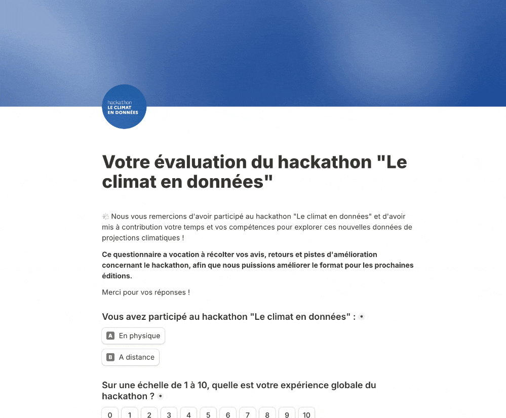

# Evaluation du hackathon

Nous aimerions connaître votre avis sur le déroulement du hackathon et la qualité des projets proposés. Nous souhaitons veiller à votre satisfaction et vos retours nous seront précieux pour les prochains événements !

**Nous vous invitons donc à nous faire part de vos remarques, commentaires et suggestions d’amélioration dans** [**ce formulaire d’évaluation**](https://tally.so/r/rjydz2)**.**

Un très grand merci par avance !

<figure><figcaption></figcaption></figure>
