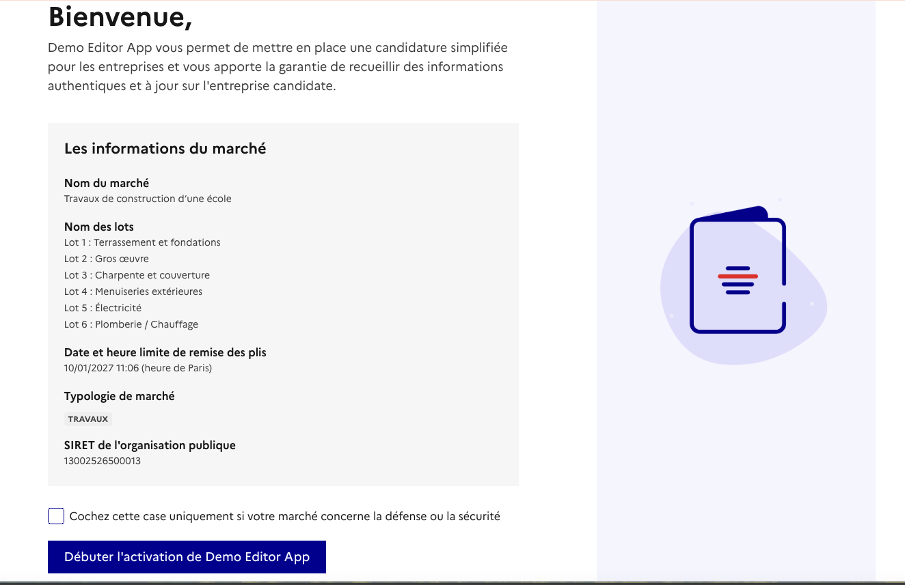

# 9. Gestion des lots

### Objectif

Permettre à l’acheteur de configurer un marché comportant plusieurs lots afin de :

* structurer son marché ;
* configurer les éléments concernant les lots du marché
*   permettre aux candidats de candidater à un ou plusieurs lots.\
    \
    Une fois les lots créés :

    * chaque lot correspond à une partie du marché
    * les entreprises pourront choisir librement les lots auxquels elles souhaitent répondre

    Vous n’imposez jamais à une entreprise de répondre à un lot précis.\
     

    <figure><figcaption></figcaption></figure>

### Réception des lots depuis votre profil acheteur

Lorsque le marché est transmis depuis votre profil acheteur :

* vous recevez directement la **liste des lots déjà définis**
* ces lots sont affichés dans Passe Marché

À ce stade, vous n’avez pas d’action obligatoire à faire sur les lots pour continuer.

<figure><figcaption></figcaption></figure>

### &#x20;Limiter le nombre de lots par candidat (optionnel)

Vous pouvez définir un nombre maximum de lots auxquels une entreprise peut candidater.

#### Exemple

* Votre marché contient 5 lots
* Vous fixez une limite à 2
* Une entreprise pourra candidater à 1 ou 2 lots, mais pas plus

<figure><figcaption></figcaption></figure>

### Continuer la configuration du marché

Que vous ayez défini une limite ou non :

vous pouvez directement passer à [la configuration des exigences](3.-parametrer-les-exigences-de-candidature.md) (pièces demandées, informations, etc.)&#x20;

La gestion des lots **n’impacte pas la configuration** :

* le fonctionnement reste le même que pour un marché classique
* vous configurez les exigences **une seule fois**
* elles s’appliquent à tous les lots (dans le cas mono-type)
