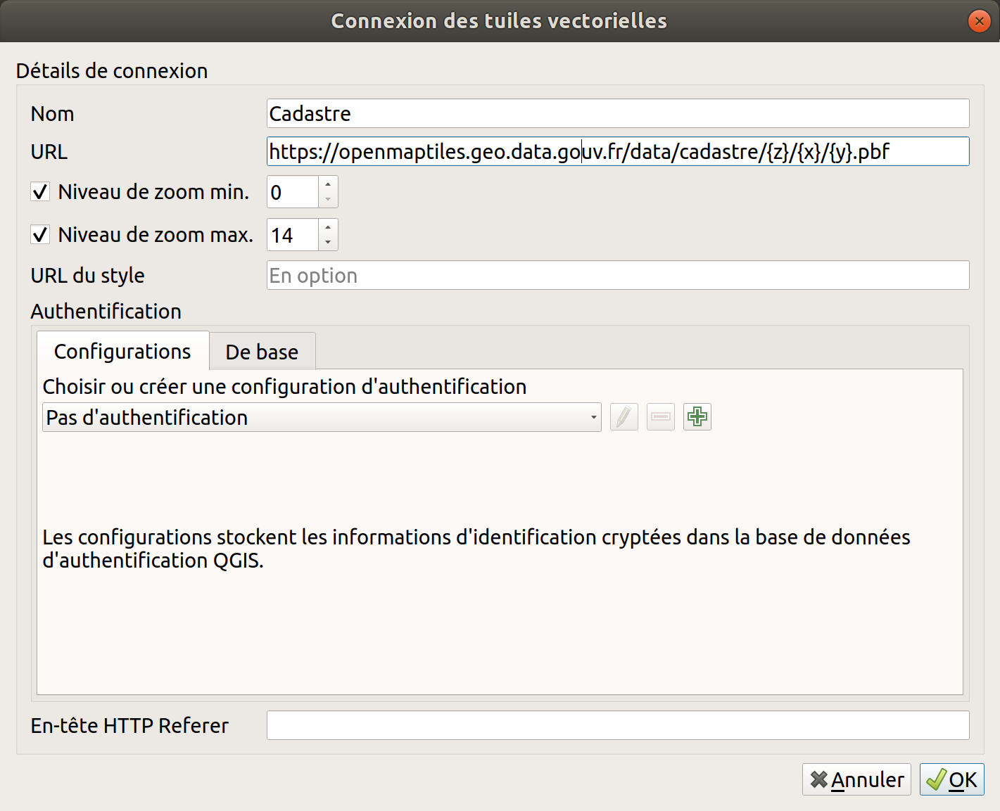

# Manipuler les données du cadastre


Dans cette section, nous vous guidons dans la manipulation des données du cadastre. Nous vous indiquons notamment comment :
- **télécharger les données**
- **rechercher des parcelles**
- **accéder aux fonds de plan du cadastre**
- **parser les données Edigeo**
- **faire l'intégration métiers parcelle et MAJIC (Fichiers des locaux et des parcelles des personnes morales)**


> Si vous avez d'autres questions, ou si vous souhaitez que nous vous aidions sur d'autres aspects de l'utilisation du cadastre, **[n'hésitez pas à nous l'indiquer ici](https://tally.so/r/wgdoJl) pour que nous puissions compléter ce guide**.

## Télécharger les données

 

**Les versions du plan cadastral**

Il existe aujourd'hui **trois versions** des données du plan cadastral :
- **la version de la Direction générale des finances publiques (DGFiP)**
  Elle est mise à jour tous les 3 mois environ, théoriquement aux 01/01, 01/04, 01/07 et 01/10 (il s'agit plutôt des dates d'extraction, les données sont réellement mises à disposition quelques jours après). Dans le cadre du [service public de la donnée (SPD)](https://www.data.gouv.fr/fr/pages/spd/reference/), la Direction interministérielle du numérique (DINUM) diffuse ces données pour le compte de la DGFiP. Plus d'informations sont disponibles sur [cette page](https://cadastre.data.gouv.fr/datasets/plan-cadastral-informatise) ;
- **la version d'Etalab**
  Elle consiste en un assemblage de données, qui s'appuie sur les données Edigeo (Plan Cadastral Informatisé issu de la DGFiP, ci-dessus) et les données de Strasbourg (hors PCI). Elle peut présenter quelques erreurs, en particulier du fait de l'interprétation des géométries issues du format Edigeo. Les formats proposés sont du *GeoJSON* et du *SHP*. Cette version étant dépendante de la version précédente mais nécessitant plus de traitement, elle requiert plusieurs semaines pour sa mise à disposition, à partir de la réception des données transmises par la DGFiP. Il s'agit d'un produit de la Direction interministérielle du numérique (DINUM). Plus d'informations sont disponibles sur [cette page](https://cadastre.data.gouv.fr/datasets/cadastre-etalab) ;
- **la version de l'Institut national de l'information géographique et forestière (IGN)** : proposée via le produit PCI Express.
  La mise à jour est effectuée après la mise à disposition des données Edigeo sur [cadastre.data.gouv.fr](cadastre.data.gouv.fr).

  

Pour télécharger les données, vous pouvez vous rendre sur :
- **Pour la version de la DGFiP** : [cadastre.data.gouv.fr/datasets/plan-cadastral-informatise](https://cadastre.data.gouv.fr/datasets/plan-cadastral-informatise) (formats *Edigeo*, *Edigeo-cc*, *DXF-PCI*, *DXF-PCI-cc*, *TIFF*) ;
- **Pour la version d'Etalab** : [cadastre.data.gouv.fr/data/etalab-cadastre](https://cadastre.data.gouv.fr/data/etalab-cadastre/) (formats *GeoJSON* et *SHP*) ;
- **Pour la version de l'IGN** : [la page "Parcellaire Express (PCI)" du site Geoservices de l'IGN](https://geoservices.ign.fr/parcellaire-express-pci).

## Rechercher des parcelles

Pour rechercher des parcelles, il est possible de passer par [**le module Cadastre de l'API Carto**](https://apicarto.ign.fr/api/doc/cadastre#/Parcelle/get_cadastre_parcelle). 

Il s'agit d'une surcouche au WFS de l'IGN qui facilite l'utilisation. Ce service s'appuie sur les données de PCI Express ou de [la BD Parcellaire](https://geoservices.ign.fr/bdparcellaire) (produit historique non maintenu depuis 2019).

Si vous êtes intéressé par le code de la surcouche, vous pouvez consulter le projet sur [https://github.com/IGNF/apicarto/](https://github.com/IGNF/apicarto/).

<figure><figcaption><p>Un exemple de recherche de parcelles avec l'API Carto</p></figcaption></figure>

*Vous pouvez aussi ouvrir* [*ce lien pour voir le résultat dans un navigateur*](https://apicarto.ign.fr/api/cadastre/parcelle?code_insee=44109&section=EX&numero=0080).

 

**Limites**

Il existe un léger décalage dans le temps de mise à jour entre les parcelles PCI Express et les données du cadastre que nous mettons à disposition sur [cadastre.data.gouv.fr](https://cadastre.data.gouv.fr). 

## Accéder aux fonds de plan du cadastre

Plusieurs solutions sont disponibles pour accéder aux fonds de plan du cadastre, parmi lesquelles :

- [**WMS accès cadastre DGFiP**](https://www.cadastre.gouv.fr/scpc/pdf/Guide_WMS_fr.pdf). La limitation principale de ce WMS est qu'il n'est possible de demander que des images dont la taille est comprise entre *100x100* et *au maximum 1280x1024*. Il est possible de passer par un TMS via l'url `http://tms.cadastre.openstreetmap.fr/*/tout/{z}/{x}/{y}.png` pour contourner cette limitation (voir https://lists.openstreetmap.org/pipermail/talk-fr/2015-February/075223.html).


- **les tuiles vectorielles mises à disposition par la Direction interministérielle du numérique (DINUM)**. Elles contiennent les géométries du produit Cadastre Etalab. Un [tutoriel](https://guides.etalab.gouv.fr/apis-geo/3-tuiles-vecteur.html#l-alternative-des-tuiles-vecteur-de-l-ign) détaille comment les exploiter dans le cadre Web. Il est aussi possible d'accéder aux tuiles vectorielles depuis la version 3.14 du [logiciel bureautique SIG OpenSource nommé QGIS](https://www.qgis.org/fr/site/) comme illustré ci-dessous.



- **IGN WMS cadastre**. La couche principale est `CADASTRALPARCELS.PARCELLAIRE_EXPRESS` du [service WMS](https://wxs.ign.fr/essentiels/geoportail/r/wms). Celle-ci s'appuie sur le produit PCI Express.

Il existe de nombreuses autres couches d'information liées aux cadastre proposées par l'IGN. Il est possible de les chercher depuis la [page de documentation de Geoservices](https://geoservices.ign.fr/documentation/services), en prenant les fichiers CSV des géoservices et de la Géoplateforme, qui remplacera dans les mois à venir les services OGC de l'IGN.

 

### Attention

Contrairement à une croyance commune, **le contour des parcelles n'est pas fiable** : il ne s'agit que d'une représentation graphique imprécise, établie avant que les photos aériennes soient généralisées et de grande précision. **Seuls les actes de vente ont une valeur juridique.**

Il faut aussi noter que les parcelles aux limites entre communes se recoupent ou donnent un "no man land" car historiquement, chaque commune gérait séparément ses parcelles et aucune ne se préoccupait de la limite exacte avec les communes limitrophes de son territoire.

Pour évaluer ce décalage entre les contours des parcelles et le terrain, il est possible d'utiliser la couche "**Décalage de la representation cadastrale**" `CADASTRALPARCELS.HEATMAP` disponible sur [le WMS](https://wxs.ign.fr/parcellaire/geoportail/r/wms) et aussi consultable sur [le Géoportail](https://www.geoportail.gouv.fr/carte?c=-1.0309918634157356,46.551302493795134&z=6&l0=ORTHOIMAGERY.ORTHOPHOTOS::GEOPORTAIL:OGC:WMTS(1)&l1=GEOGRAPHICALGRIDSYSTEMS.PLANIGNV2::GEOPORTAIL:OGC:WMTS(1)&l2=CADASTRALPARCELS.HEATMAP::GEOPORTAIL:OGC:WMTS(0.9)&l3=CADASTRALPARCELS.PARCELLAIRE_EXPRESS::GEOPORTAIL:OGC:WMTS(1)&permalink=yes). Cette couche couvre une grande partie du territoire, mais pas son ensemble.



<figure><figcaption><p>Un exemple de décalage de parcelles avec différents niveaux de précision</p></figcaption></figure>

## Parser les données Edigeo

EDIGEO signifie "*Échange de données informatisées dans le domaine de l'information géographique*". Il s'agit d'une norme. C'est principalement la norme d'échange des données du Plan Cadastral Informatisé (PCI). 

> Pour aller plus loin, vous pouvez consulter [l'article Wikipedia associé](https://fr.wikipedia.org/wiki/EDIGEO) et [la documentation "Standard d'échange des objets du Plan Cadastral Informatisé fondé sur la norme EDIGéO" datant de 2013](https://raw.githubusercontent.com/etalab/edigeo-parser/master/resources/standard_edigeo_2013.pdf).

### Logiciels/Bibliothèques pour les exploiter

Pour parser les données Edigeo, plusieurs méthodes sont possibles. Vous pouvez notamment :
- [Parser en Javascript](https://github.com/etalab/edigeo-parser) : c'est ce parser qui est utilisé pour produire les données Etalab Cadastre ;
- [Utiliser GDAL](https://gdal.org/drivers/vector/edigeo.html) ;
- [Utiliser cet outil edigeoToGeojson](https://github.com/DoFabien/edigeoToGeojson) ;
- [Parser en Dotnet](https://github.com/ChristopheVergon/Integrateur_edigeo) : ce parser est utilisé par le GIRTEC pour son intégration en base de données ;
- Parser MAJIC fourni par le connecteur MAJIC associé [au logiciel propriétaire FME](https://www.veremes.com/produits/majic).

## Faire l'intégration métier parcelles et MAJIC


Il est nécessaire de distinguer les données Plan Cadastral Informatisé (PCI) des données MAJIC : 
- **Les données PCI** sont la représentation graphique des parcelles, mais aucune information associée aux propriétaires n'est fournie.
- **Les données MAJIC** (on parle aussi de matrice cadastrale) contiennent les données liées aux bâtiments, aux propriétaires. Elles sont à caractère personnel donc non ouvertes (à l'exception de celles se rapportant aux personnes morales, disponibles en open data). Elles peuvent être utiles, mais certains types d'acteurs qui ont besoin d'une base exhaustive liée à la propriété (comme les collectivités) peuvent souhaiter avoir accès aux données non ouvertes. 


Le [**jeu de données "Fichiers des locaux et des parcelles des personnes morales" (MAJIC)**](https://www.data.gouv.fr/fr/datasets/fichiers-des-locaux-et-des-parcelles-des-personnes-morales/) contient trois fichiers principaux :
- Les fichiers des personnes morales recensent au niveau départemental les personnes morales qui apparaissent dans la documentation cadastrale, en situation du 1er janvier de l'année de référence (n ou n-1 selon la date de téléchargement), comme détentrices de droits réels sur des immeubles, à l'exception des sociétés unipersonnelles et des entrepreneurs individuels ;
- Les fichiers des propriétés bâties (locaux) restituent les références cadastrales et l'adresse des locaux, complétés du code droit, de la dénomination et de la forme juridique des personnes morales propriétaires ;
- Les fichiers des propriétés non bâties (parcelles) restituent les références cadastrales, l'adresse, la contenance et la nature de culture des parcelles, complétées du code droit, de la dénomination et de la forme juridique des personnes morales propriétaires.

**Pour réaliser une intégration métier parcelles et MAJIC, plusieurs solutions sont mises à disposition :**

### Solutions open source

Il est possible d'utiliser le [**Plugin cadastre QGIS**](https://github.com/3liz/QgisCadastrePlugin) et de [récupérer les données du cadastre via ce plugin depuis des codes INSEE](https://github.com/3liz/QgisCadastrePlugin/blob/master/docs/extension-qgis/donnees.md).


Depuis QGIS, dans la console PyQGIS,

```python
import processing

processing.run("cadastre:telechargeur_edigeo_communal", {'LISTE_CODE_INSEE':'44109,44143,44162,44026,44190,44215','FILTRE':'','DOSSIER':'/tmp/cadastre-out','DATE':'latest','URL_TEMPLATE':'https://cadastre.data.gouv.fr/data/dgfip-pci-vecteur/{date}/edigeo/feuilles/{departement}/{commune}/'})
```

En ligne de commande si le plugin cadastre est installé

```bash

qgis_process run cadastre:telechargeur_edigeo_communal -- LISTE_CODE_INSEE=44109,44143,44162,44026,44190,44215 FILTRE= DOSSIER=/tmp/cadastre-out DATE=latest URL_TEMPLATE=https://cadastre.data.gouv.fr/data/dgfip-pci-vecteur/{date}/edigeo/feuilles/{departement}/{commune}/

# déduit de la commande suivante en s'appuyant sur https://docs.qgis.org/3.28/fr/docs/user_manual/processing/standalone.html
qgis_process help cadastre:telechargeur_edigeo_communal
```

### Solutions propriétaires

Deux outils sont disponibles :

- [ESRI (produits ArcGIS)](https://www.arcopole.fr/content/cadastre)
- [FME MAJIC](https://www.veremes.com/produits/majic)
