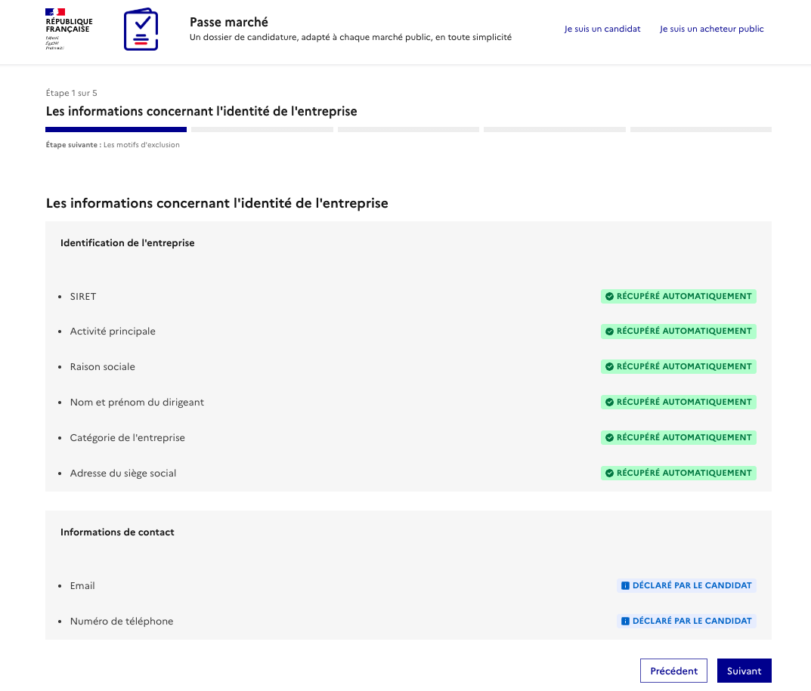

# Compte utilisateur et organisation

## Pourquoi créer un compte utilisateur ?  

Le téléchargement de jeux de données ne requiert pas d’inscription sur la plateforme data.gouv.fr mais le fait de s'enregistrer permet notamment de :&#x20;

* mettre en ligne des données ;
* référencer des réutilisations de données ;
* ouvrir une discussion au sujet d’un jeu de données ;
* suivre les publication d’un autre utilisateur ;
* créer, rejoindre, ou suivre une organisation.

\
[**Se créer un compte utilisateur**](https://www.data.gouv.fr/fr/register?next=%2Ffr%2Fregister)

En fonction de votre besoin, vous pouvez vouloir publier un jeu de données en tant qu’utilisateur individuel ou en tant qu’organisation.


**Qu'est-ce qu'une organisation ?**

Une organisation est une entité au travers de laquelle plusieurs utilisateurs peuvent collaborer sur des jeux de données. Les jeux de données publiés au nom de l’organisation peuvent être édités par les membres de l’organisation. Elle peut contenir plusieurs utilisateurs et un même utilisateur peut appartenir à plusieurs organisations.


Nous vous conseillons de [créer une organisation](https://doc.data.gouv.fr/organisations/creer-une-organisation/) ou [rejoindre une organisation](https://doc.data.gouv.fr/organisations/creer-une-organisation/) existante si vous souhaitez :

1. publier des jeux de données pour le compte d’une organisation publique ou privé (administration, collectivité, association, entreprise, etc. );
2. permettre à des utilisateurs différents de publier et modifier des jeux de données sous le même nom, la même bannière.

### Différences entre administateur et éditeur

Une organisation se compose d’administrateurs et d’éditeurs qui ont permissions différentes.

| Permissions                                                          | Administrateur | Editeur |
| -------------------------------------------------------------------- | -------------- | ------- |
| Publier des jeux de données au nom de l’organisation ;               | ✅              | ✅       |
| Répondre aux commentaires / discussions associés aux jeux de données | ✅              | ✅       |
| Référencer des réutilisations au nom de l’organisation ;             | ✅              | ✅       |
| Modifier des jeux de données existants ;                             | ✅              | ✅       |
| Consulter les demandes d’adhésion à l’organisation.                  | ✅              | ✅       |
| Ajouter des utilisateurs à l’organisation                            | ✅              | ❌       |
| Accepter ou valider les demandes d’adhésion à l’organisation         | ✅              | ❌       |
| Retirer un utilisateur d’une organisation                            | ✅              | ❌       |
| Supprimer l’organisation dont il est administrateur                  | ✅              | ❌       |

## Suivre l'activité de son organisation

L’ensemble des activités de votre organisation peuvent être consultées à partir d’un tableau de bord. Ce tableau de bord centralise les informations suivantes :

* la description de l’organisation et la liste de ses membres ;
* les métriques rattachées à chaque jeu de données, ressources ou réutilisation publiée ;
* les anomalies constatées à propos des jeux de données publiés ;
* les discussions ouvertes à propos des jeux publiés ;
* l’activité des moissonneurs ([voir la partie moissonnage de ce guide](https://guides.etalab.gouv.fr/data.gouv.fr/3-publier-un-jeu-de-donnees.html#publier-un-catalogue-de-donn%C3%A9es-existant-par-moissonnage)).

<figure><figcaption></figcaption></figure>

## &#x20;

## &#x20;

## Gérer les membres de son organisation 

### Ajouter un membre à une organisation 

Un administrateur peut ajouter n’importe quel utilisateur de data.gouv.fr à une organisation dont vous êtes administrateur en utilisant son nom et son prénom.

1. [Connectez-vous à votre compte](https://www.data.gouv.fr/fr/login) ;
2. Rendez-vous sur [votre tableau de bord](https://www.data.gouv.fr/fr/admin/), en cliquant sur **Administration** en haut à droite de votre écran ;
3. Allez sur la page de suivi de l’organisation à laquelle vous souhaitez ajouter un membre, en cliquant sur le nom de votre organisation, dans la colonne de gauche ;
4. Dans le bloc **Membres**, sur la droite de votre écran, cliquez sur le bouton **Ajouter** ;
5. Saisissez le prénom et le nom de l’utilisateur à ajouter, puis sélectionnez-le quand vous le voyez apparaître dans la liste ;
6. Définissez le niveau de permission que vous souhaitez accorder à ce nouveau membre, en le faisant **Admin** (administrateur) ou **Editor** (éditeur) ;
7. Cliquez sur le bouton **Valider** pour valider l’ajout du membre.

De son côté, l’utilisateur ajouté à votre organisation pourra alors publier des données ou des réutilisations au nom de votre organisation.



## Retirer un utilisateur d’une organisation 

Si un membre de votre organisation n’a plus besoin d’en faire partie, vous pouvez le retirer de l’organisation. Retirer un utilisateur d’une organisation ne supprime pas le compte de l’utilisateur en question.

Seuls les administrateurs d’une organisation peuvent retirer des membres de leur organisation, les éditeurs n’en ont pas la possibilité.

### Comment retirer un membre 

Pour retirer un membre d’une organisation dont vous êtes administrateur :

1. [Connectez-vous à votre compte](https://www.data.gouv.fr/fr/login) ;
2. Rendez-vous sur [votre tableau de bord](https://www.data.gouv.fr/fr/admin/), en cliquant sur **Administration** en haut à droite de votre écran ;
3. Allez sur la page de suivi de l’organisation à laquelle vous souhaitez retirer un membre, en cliquant sur le nom de votre organisation, dans la colonne de gauche ;
4. Dans le bloc **Membres**, sur la droite de votre écran, cliquez sur le nom du membre que vous souhaitez retirer ;
5. Dans la fenêtre qui s’ouvre alors, cliquez sur **Supprimer** ;
6. Rafraichissez votre page pour constater le retrait du membre.

## Supprimer une organisation 

N’importe quel utilisateur peut créer une organisation mais seuls ceux qui en sont administrateurs peuvent ensuite la supprimer.

Quand une organisation est supprimée, les jeux de données et les ressources qui avaient été publiés en son nom _restent en ligne_, aux mêmes URL, mais sous forme anonyme, c’est-à-dire sans être rattachés à un producteur.

### À propos de l’ordre des suppressions 

L’ordre des suppressions a son importance. Si vous souhaitez _aussi_ supprimer les jeux de données publiés par l’organisation que vous êtes sur le point de clôturer, commencez par supprimer les jeux de données en question un par un _avant_ de supprimer l’organisation en elle-même.

### Comment supprimer une organisation 

Pour supprimer une organisation dont vous êtes administrateur :

1. [Connectez-vous à votre compte](https://www.data.gouv.fr/fr/login) ;
2. Rendez-vous sur [votre tableau de bord](https://www.data.gouv.fr/fr/admin/), en cliquant sur **Administration** en haut à droite de votre écran ;
3. Allez sur la page de suivi de l’organisation à supprimer, en cliquant sur le nom de votre organisation, dans la colonne de gauche ;
4. Cliquez sur la flèche située à côté du bouton **Éditer**, en haut à droite de votre écran, puis sur **Supprimer** dans le menu déroulant qui apparaît alors ;
5. Validez la suppression de l’organisation en cliquant sur le bouton **Confirmer** dans la fenêtre rouge qui s’ouvre alors en superposition.
